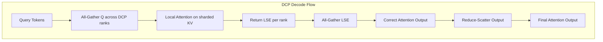

# DCP 60k Token Corruption Investigation Plan

## Problem Summary

**Symptom:** Garbled/nonsensical output during decode phase after ~60k total context tokens
**Configuration:** TP=8, PP=4, DCP=8 (via `SGLANG_DCP=8`), page_size=1, RadixCache enabled, chunked_prefill_size=4096
**Reproducibility:** Consistent at ~60k tokens
**Baseline:** Works correctly without DCP (`SGLANG_DCP=1`)

## ROOT CAUSE IDENTIFIED ✅

### Error Message
```
RuntimeError: The expanded size of the tensor (3850) must match the existing size (4096)
at non-singleton dimension 0.  Target sizes: [3850, 1, 512].  Tensor sizes: [4096, 1, 512]
```

### Location
[`deepseek_v2.py:1953`](python/sglang/srt/models/deepseek_v2.py:1953) in `forward_absorb_prepare`

### Bug Analysis

The bug occurs in the DCP extend path when copying local KV cache into `dcp_kv_buffer`:

```python
# Line 1953-1958 in deepseek_v2.py
forward_batch.dcp_kv_buffer[
    forward_batch.dcp_extend_prefix_lens_sum :, ..., : self.kv_lora_rank
] = k_nope  # k_nope has shape [3850, 1, 512]
```

**The Problem:**
1. `dcp_kv_buffer` is allocated with size `forward_batch.seq_lens_sum` at [`model_runner.py:2454-2461`](python/sglang/srt/model_executor/model_runner.py:2454)
2. The slice `dcp_kv_buffer[dcp_extend_prefix_lens_sum:]` expects to hold `seq_lens_sum - dcp_extend_prefix_lens_sum` tokens
3. But `k_nope` has `extend_seq_len` tokens (the current chunk being processed)
4. When `extend_seq_len != seq_lens_sum - dcp_extend_prefix_lens_sum`, the shapes mismatch

**Why it happens at ~60k tokens:**
- With `chunked_prefill_size=4096`, a 61,648 token input is split into 15 chunks of 4096 + 1 chunk of 208
- The last chunk has `extend_seq_len=208` but the buffer slice expects 4096 tokens
- Actually looking at the error: 3850 vs 4096 suggests the issue is with how `seq_lens_sum` is computed vs actual extend length

### The Fix

The slice should use the actual extend length, not assume the buffer remainder equals extend length:

```python
# Current buggy code:
forward_batch.dcp_kv_buffer[
    forward_batch.dcp_extend_prefix_lens_sum :, ..., : self.kv_lora_rank
] = k_nope

# Fixed code:
extend_len = k_nope.shape[0]
forward_batch.dcp_kv_buffer[
    forward_batch.dcp_extend_prefix_lens_sum : forward_batch.dcp_extend_prefix_lens_sum + extend_len,
    ...,
    : self.kv_lora_rank
] = k_nope
forward_batch.dcp_kv_buffer[
    forward_batch.dcp_extend_prefix_lens_sum : forward_batch.dcp_extend_prefix_lens_sum + extend_len,
    ...,
    self.kv_lora_rank :
] = k_pe
```

**Alternative Fix:** Ensure `dcp_kv_buffer` is allocated with the correct size:
```python
# In model_runner.py:2454
# Current: forward_batch.seq_lens_sum
# Should be: extend_prefix_lens_sum + extend_seq_lens_sum
forward_batch.dcp_kv_buffer = torch.empty(
    (
        extend_prefix_lens_sum + forward_batch.extend_seq_lens.sum().item(),
        *forward_batch.token_to_kv_pool.get_key_buffer(forward_batch.token_to_kv_pool.start_layer).shape[1:],
    ),
    dtype=self.kv_cache_dtype,
    device=self.device,
)
```

## Architecture Overview



## Potential Root Causes

### 1. Integer Overflow in KV Index Calculations

**Hypothesis:** At 60k tokens with DCP=8, the KV indices may overflow `int32` bounds in certain calculations.

**Critical Calculation:**
```python
# In flashinfer_mla_backend.py:756
paged_kernel_lens_split = ((lens - dcp_rank - 1) // dcp_world_size) + 1
```

**Analysis:**
- With 60k tokens and DCP=8: each rank handles ~7,500 tokens
- `kv_indptr` cumsum could reach 60k × batch_size
- If batch_size is large, this could approach int32 limits

**Files to Check:**
- [`flashinfer_mla_backend.py:746-790`](python/sglang/srt/layers/attention/flashinfer_mla_backend.py:746) - `filter_seq_indices` function
- [`flashinfer_mla_backend.py:469-474`](python/sglang/srt/layers/attention/flashinfer_mla_backend.py:469) - `kv_len_arr_cpu` calculation

### 2. LSE Numerical Precision Issues

**Hypothesis:** The log-sum-exp correction kernel may have numerical instability at large context lengths.

**Critical Code:**
```python
# In utils.py:474-482
lse = tl.load(lses_ptr + lse_offsets)
lse = tl.where((lse != lse) | (lse == float("inf")), -float("inf"), lse)
lse_max = tl.max(lse, axis=0)
lse_max = tl.where(lse_max == -float("inf"), 0, lse_max)
lse -= lse_max
lse_exp = tl.exp2(lse)  # exp2 instead of exp - potential precision issue
lse_acc = tl.sum(lse_exp, axis=0)
lse = tl.log2(lse_acc)
lse += lse_max
```

**Analysis:**
- LSE values grow with log(context_length)
- At 60k tokens: LSE ≈ log2(60000) ≈ 15.87
- With 8 DCP ranks, each rank's LSE could differ significantly
- The `exp2(lse_finally)` factor calculation at line 505 could underflow/overflow

**Files to Check:**
- [`utils.py:431-509`](python/sglang/srt/layers/attention/utils.py:431) - `_correct_attn_cp_out_kernel`
- [`utils.py:525-590`](python/sglang/srt/layers/attention/utils.py:525) - `correct_attn_out`
- [`utils.py:593-614`](python/sglang/srt/layers/attention/utils.py:593) - `cp_lse_ag_out_rs`

### 3. RadixCache + DCP Interaction Bug

**Hypothesis:** RadixCache page alignment with DCP may cause incorrect KV cache lookups at certain lengths.

**Critical Code:**
```python
# In scheduler.py:684
if get_dcp_world_size() > 1:
    params.page_size = params.page_size * get_dcp_world_size()
```

**Analysis:**
- RadixCache page_size becomes 1 × 8 = 8
- Token-to-KV mapping must satisfy: `kv_index % dcp_world_size == token_index % dcp_world_size`
- At 60k tokens, if there's any misalignment, it would cause incorrect KV lookups

**Files to Check:**
- [`allocator.py:524-596`](python/sglang/srt/mem_cache/allocator.py:524) - `DcpTokenToKVPoolAllocator`
- [`scheduler.py:463-472`](python/sglang/srt/managers/scheduler.py:463) - `init_truncation_align_size_for_dcp`
- [`common.py:360`](python/sglang/srt/mem_cache/common.py:360) - DCP page allocation

### 4. CUDA Graph Replay with Stale Metadata

**Hypothesis:** CUDA graph replay may use stale KV indices when context exceeds certain thresholds.

**Critical Code:**
```python
# In flashinfer_mla_backend.py:776-786
if init_metadata_replay:
    # For cuda graph replay, we must pack the DCP-filtered indices
    # back into the shared kv_indices buffer
    local_kv_indices = (
        kv_indices[filterd_kv_indices] // get_dcp_world_size()
    )
    kv_indices[: local_kv_indices.numel()] = local_kv_indices
```

**Analysis:**
- CUDA graph captures fixed buffer sizes
- At 60k tokens, the `kv_indices` buffer may overflow its captured size
- The `cuda_graph_kv_indices` is allocated with `max_bs * max_context_len`

**Files to Check:**
- [`flashinfer_mla_backend.py:344-373`](python/sglang/srt/layers/attention/flashinfer_mla_backend.py:344) - `init_cuda_graph_state`
- [`flashinfer_mla_backend.py:455-516`](python/sglang/srt/layers/attention/flashinfer_mla_backend.py:455) - `init_forward_metadata_replay_cuda_graph`

### 5. All-Gather/Reduce-Scatter Synchronization Issue

**Hypothesis:** Async communication operations may not complete before attention computation at high token counts.

**Critical Code:**
```python
# In deepseek_v2.py:2074-2079
with use_symmetric_memory(get_dcp_group()):
    attn_output = attn_output.view(
        -1, self.num_local_heads * get_dcp_world_size(), self.kv_lora_rank
    ).clone(memory_format=torch.contiguous_format)
    lse = lse.clone(memory_format=torch.contiguous_format)
attn_output = cp_lse_ag_out_rs(attn_output, lse, get_dcp_group())
```

**Files to Check:**
- [`deepseek_v2.py:1927-1960`](python/sglang/srt/models/deepseek_v2.py:1927) - Q all-gather for decode
- [`deepseek_v2.py:2072-2079`](python/sglang/srt/models/deepseek_v2.py:2072) - LSE correction and reduce-scatter

## Diagnostic Steps

### Step 1: Add Logging to Identify Exact Failure Point

Add debug logging to track:
1. Token count when corruption starts
2. KV indices values at corruption point
3. LSE values before/after correction
4. Attention output statistics (mean, std, NaN count)

### Step 2: Test with Reduced DCP Size

Test with `SGLANG_DCP=2` and `SGLANG_DCP=4` to see if the threshold changes proportionally:
- If threshold scales with DCP size → likely index calculation issue
- If threshold is constant → likely numerical precision issue

### Step 3: Disable CUDA Graphs

Test with `--disable-cuda-graph` to rule out CUDA graph replay issues.

### Step 4: Disable RadixCache

Test with `--disable-radix-cache` to rule out cache interaction issues.

### Step 5: Add Numerical Checks

Add assertions in the LSE correction kernel:
```python
# Check for NaN/Inf in LSE values
assert not torch.isnan(lse).any(), f"NaN in LSE at token {total_tokens}"
assert not torch.isinf(lse).any(), f"Inf in LSE at token {total_tokens}"

# Check attention output range
assert attn_output.abs().max() < 1000, f"Attention output explosion at token {total_tokens}"
```

## Recommended Fixes to Investigate

### Fix 1: Use int64 for KV Index Calculations

```python
# In flashinfer_mla_backend.py
lens = paged_kernel_lens.to(torch.int64)  # Already done
starts = paged_kernel_lens_cumsum[:-1].to(torch.int64)  # Already done
# Ensure kv_indices is also int64
kv_indices = torch.empty(paged_kernel_lens_sum, dtype=torch.int64, device="cuda")
```

### Fix 2: Improve LSE Numerical Stability

```python
# In utils.py - use higher precision for intermediate calculations
lse = tl.load(lses_ptr + lse_offsets).to(tl.float32)  # Force float32
# ... rest of calculation in float32 ...
```

### Fix 3: Validate KV Index Bounds

```python
# Add bounds checking
max_kv_index = kv_buffer.shape[0]
assert (kv_indices < max_kv_index).all(), f"KV index out of bounds: max={kv_indices.max()}, buffer_size={max_kv_index}"
```

## Next Steps

1. [ ] Add debug logging to identify exact failure point
2. [ ] Run diagnostic tests (reduced DCP, no CUDA graph, no RadixCache)
3. [ ] Implement numerical stability improvements in LSE correction
4. [ ] Add bounds checking for KV indices
5. [ ] Test fixes with 60k+ token contexts
