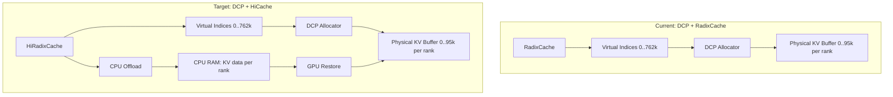

# DCP + HiCache Implementation Plan

## Problem Statement

HiCache (Hierarchical Cache) offloads cold KV cache from GPU to CPU RAM to increase effective capacity. DCP (Decode Context Parallelism) shards KV cache across multiple GPUs using virtual indices. Currently these two features are incompatible — combining them causes `CUDA error: an illegal memory access` at `hiradix_cache.py:1144`.

## Root Cause

The crash occurs because:
1. DCP uses **virtual KV indices** (0 to `real_kv_size * dcp_world_size`) stored in RadixCache/HiRadixCache tree nodes
2. HiCache evicts tree nodes to CPU, freeing the GPU KV buffer at the physical locations
3. When HiCache restores nodes or `torch.cat(value)` concatenates stored indices, some reference freed GPU memory
4. The DCP allocator's `filter_local_indices()` divides virtual indices by `dcp_world_size` to get physical locations, but HiCache doesn't know about this mapping

## Architecture Overview



## Key Insight

With DCP, each rank only stores 1/dcp_world_size of the tokens. When HiCache offloads KV cache to CPU:
- It should only offload the **local rank's portion** (1/8 of the tokens)
- The virtual indices in the tree remain unchanged (they're just metadata)
- The physical KV data at `virtual_index // dcp_world_size` is what gets offloaded/restored

## Implementation Steps

### Step 1: Understand HiCache's Offload/Restore Flow

**Files to study:**
- `python/sglang/srt/mem_cache/hiradix_cache.py` — HiRadixCache implementation
- `python/sglang/srt/mem_cache/memory_pool.py` — KV pool with CPU copy support
- `python/sglang/srt/mem_cache/allocator.py` — DcpTokenToKVPoolAllocator

**Key methods:**
- `HiRadixCache.evict()` — evicts a node's KV data to CPU
- `HiRadixCache._restore_node()` — restores KV data from CPU to GPU
- `DcpTokenToKVPoolAllocator.get_cpu_copy()` — already translates virtual→physical indices
- `DcpTokenToKVPoolAllocator.load_cpu_copy()` — already translates virtual→physical indices

### Step 2: Fix the `torch.cat(value)` Crash

**Location:** `hiradix_cache.py:1144`

**Problem:** The `value` list contains tensors that reference freed GPU memory after eviction.

**Fix:** When a node is evicted, its `value` (GPU indices tensor) should be moved to CPU or replaced with a CPU tensor. The `torch.cat` should work on CPU tensors for evicted nodes.

```python
# In match_prefix, line 1144
if value:
    # Ensure all value tensors are on the same device before cat
    # Evicted nodes may have CPU-only values
    device_values = [v for v in value if v.device.type == 'cuda']
    if device_values:
        value = torch.cat(device_values)
    else:
        value = empty_value
```

### Step 3: DCP-Aware KV Offload

**Location:** HiRadixCache eviction logic

**Current behavior:** HiCache calls `get_cpu_copy(indices)` to copy KV data to CPU.

**DCP behavior needed:** The `DcpTokenToKVPoolAllocator.get_cpu_copy()` already handles the virtual→physical translation:
```python
def get_cpu_copy(self, indices):
    return self.real_allocator.get_cpu_copy(self.filter_local_indices(indices))
```

This means HiCache's eviction should work correctly IF it goes through the DCP allocator's `get_cpu_copy`. We need to verify this path is used.

### Step 4: DCP-Aware KV Restore

**Location:** HiRadixCache restore logic

**Current behavior:** HiCache calls `load_cpu_copy(kv_cache_cpu, indices)` to restore KV data.

**DCP behavior needed:** The `DcpTokenToKVPoolAllocator.load_cpu_copy()` already handles translation:
```python
def load_cpu_copy(self, kv_cache_cpu, indices):
    return self.real_allocator.load_cpu_copy(
        kv_cache_cpu, self.filter_local_indices(indices)
    )
```

### Step 5: Handle Page Size Alignment

With DCP, `page_size = dcp_world_size * original_page_size = 8`. HiCache must respect this alignment when:
- Evicting nodes (evict in pages of 8)
- Restoring nodes (restore in pages of 8)
- Tracking which pages are on GPU vs CPU

### Step 6: Handle the `hicache_ratio` Calculation

HiCache uses `hicache_ratio` to determine how much CPU RAM to allocate. With DCP:
- GPU KV capacity: `real_kv_size` per rank
- CPU KV capacity: `real_kv_size * hicache_ratio` per rank
- Virtual capacity: `real_kv_size * dcp_world_size` total

The ratio should be applied to the **physical** KV size, not the virtual size.

### Step 7: Test Matrix

| Test Case | Expected |
|-----------|----------|
| DCP=8 + HiCache, short requests | No crash, correct output |
| DCP=8 + HiCache, 60k+ token requests | No crash, correct output |
| DCP=8 + HiCache, eviction triggered | KV correctly offloaded to CPU |
| DCP=8 + HiCache, restore from CPU | KV correctly restored, correct output |
| DCP=8 + HiCache, prefix cache hit after eviction | Correct prefix matching |
| DCP=8 + HiCache + PP=4 | All PP ranks handle correctly |

## Detailed Code Changes

### Change 1: `hiradix_cache.py` — Safe `torch.cat` for evicted nodes

```python
# Line 1142-1146
value, last_node = self._match_prefix_helper(self.root_node, key)
if value:
    # Filter out None/invalid values from evicted nodes
    valid_values = [v for v in value if v is not None and v.numel() > 0]
    if valid_values:
        value = torch.cat(valid_values)
    else:
        value = empty_value
else:
    value = empty_value
```

### Change 2: `hiradix_cache.py` — DCP-aware eviction

Ensure eviction goes through the DCP allocator's `get_cpu_copy`:

```python
def _evict_node(self, node):
    if node.value is not None:
        # Use the allocator's get_cpu_copy which handles DCP translation
        cpu_kv = self.token_to_kv_pool_allocator.get_cpu_copy(node.value)
        node.host_value = cpu_kv
        node.evicted = True
        # Free the GPU indices through DCP allocator
        self.token_to_kv_pool_allocator.free(node.value)
        node.value = None  # Clear GPU reference
```

### Change 3: `hiradix_cache.py` — DCP-aware restoration

```python
def _restore_node(self, node):
    if node.evicted and node.host_value is not None:
        # Allocate new GPU indices through DCP allocator
        new_indices = self.token_to_kv_pool_allocator.alloc(len(node.key))
        if new_indices is not None:
            # Load CPU data back through DCP allocator
            self.token_to_kv_pool_allocator.load_cpu_copy(
                node.host_value, new_indices
            )
            node.value = new_indices
            node.evicted = False
```

### Change 4: `allocator.py` — Ensure DCP allocator supports HiCache operations

The `DcpTokenToKVPoolAllocator` already has `get_cpu_copy` and `load_cpu_copy` that translate indices. Verify these work correctly with HiCache's expected data format.

## Risk Assessment

| Risk | Likelihood | Impact | Mitigation |
|------|-----------|--------|------------|
| Index translation errors | Medium | High (data corruption) | Extensive testing with assertions |
| Memory leak during eviction/restore | Medium | Medium (gradual OOM) | Memory accounting checks |
| Race conditions in multi-rank eviction | Low | High (crash) | Synchronize eviction across DCP ranks |
| Performance regression | Low | Medium | Benchmark before/after |

## Dependencies

- DCP allocator's `get_cpu_copy`/`load_cpu_copy` must be correct
- HiCache's eviction policy must respect DCP page alignment
- All DCP ranks must evict/restore the same nodes simultaneously

## Estimated Scope

- **Core changes:** ~200-300 lines across 3 files
- **Testing:** ~100 lines of test code
- **Risk:** Medium — requires careful index translation
