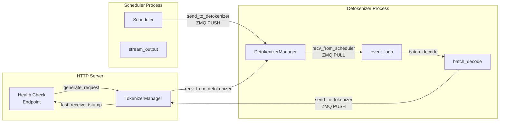

# Detokenizer Health Check Timeout Investigation and Fix Plan

## Status: Analysis Complete

**Date:** 2026-02-26

## Problem Summary

The server health check is failing because the detokenizer process is not responding within the 120-second timeout:

```
Server couldn't get a response from detokenizer for last 120 seconds
last_heartbeat time: 20:07:34
```

Key observations from the logs:
- Scheduler is still actively batching requests (`scheduler.cur_batch.batch_size()=8`)
- Multiple requests have `ignore_eos=True` with streaming enabled
- Same prompts are repeated many times (indicating client retries)
- Detokenizer hasn't sent a heartbeat for 120+ seconds

## Architecture Overview



## Health Check Mechanism

The health check at [`http_server.py:506-529`](python/sglang/srt/entrypoints/http_server.py:506) works as follows:

1. Creates a health check request with `rid=HEALTH_CHECK_{timestamp}`
2. Sends it through the normal request pipeline
3. Waits up to `HEALTH_CHECK_TIMEOUT` (120s) for `last_receive_tstamp` to update
4. If no response received, returns 503 and marks server as unhealthy

```python
# Health check logic
while time.time() < tic + HEALTH_CHECK_TIMEOUT:
    await asyncio.sleep(1)
    if _global_state.tokenizer_manager.last_receive_tstamp > tic:
        return Response(status_code=200)
return Response(status_code=503)  # Timeout - unhealthy
```

## Detokenizer Event Loop

The detokenizer at [`detokenizer_manager.py:144-152`](python/sglang/srt/managers/detokenizer_manager.py:144) runs a synchronous event loop:

```python
def event_loop(self):
    while True:
        with self.soft_watchdog.disable():
            recv_obj = self.recv_from_scheduler.recv_pyobj()  # BLOCKING
        output = self._request_dispatcher(recv_obj)
        if output is not None:
            self.send_to_tokenizer.send_pyobj(output)  # BLOCKING
        self.soft_watchdog.feed()
```

**Critical Blocking Points:**
1. `recv_from_scheduler.recv_pyobj()` - Blocks waiting for scheduler output
2. `send_to_tokenizer.send_pyobj(output)` - Blocks if tokenizer is slow to receive

## Root Cause Analysis

### Primary Cause: Streaming Backpressure

When many streaming requests are active:

1. **Client-side slowness**: If clients are slow to consume streamed responses, the HTTP server's write buffers fill up
2. **TokenizerManager backpressure**: The tokenizer manager's ZMQ socket can't accept more messages
3. **Detokenizer blocks**: `send_to_tokenizer.send_pyobj()` blocks because the ZMQ PUSH socket is full
4. **No heartbeat**: While blocked, detokenizer can't process new messages or send heartbeats

### Contributing Factors

1. **`ignore_eos=True` requests**: These can generate very long outputs, creating sustained streaming load
2. **Client retry storms**: When clients don't receive responses, they retry, multiplying the load
3. **Batch decode CPU time**: Large batches with many tokens can take significant CPU time in `tokenizer.batch_decode()`
4. **LimitedCapacityDict eviction**: If `DETOKENIZER_MAX_STATES` (65536) is exceeded, state eviction can cause errors

### Evidence from Logs

- Multiple requests with same prompt text (retry storm)
- `ignore_eos=True` on several requests
- Scheduler still processing (`batch_size=8`) but detokenizer not responding
- 120+ seconds since last heartbeat

## Proposed Fixes

### Fix 1: Non-blocking ZMQ Sends with Timeout (High Priority)

**File:** [`detokenizer_manager.py`](python/sglang/srt/managers/detokenizer_manager.py)

Add timeout to ZMQ send operations to prevent indefinite blocking:

```python
def event_loop(self):
    while True:
        with self.soft_watchdog.disable():
            recv_obj = self.recv_from_scheduler.recv_pyobj()
        output = self._request_dispatcher(recv_obj)
        if output is not None:
            # Use non-blocking send with timeout
            try:
                self.send_to_tokenizer.send_pyobj(output, flags=zmq.NOBLOCK)
            except zmq.Again:
                # Socket full - log warning and continue
                logger.warning("Detokenizer send buffer full, dropping output")
        self.soft_watchdog.feed()
```

Or use `SNDTIMEO` socket option:
```python
self.send_to_tokenizer.setsockopt(zmq.SNDTIMEO, 5000)  # 5 second timeout
```

### Fix 2: Separate Health Check Path (High Priority)

**File:** [`scheduler.py`](python/sglang/srt/managers/scheduler.py)

The scheduler already has a bypass for health checks at line 2553-2559:

```python
def maybe_send_health_check_signal(self):
    if self.return_health_check_ct:
        # Return some signal for the health check.
        # This is used to prevent the health check signal being blocked by long context prefill.
        # However, one minor issue is that this code path does not check the status of detokenizer manager.
        self.return_health_check_ct -= 1
        self.send_to_tokenizer.send_output(HealthCheckOutput())
```

**Issue:** This bypasses detokenizer but doesn't verify detokenizer is healthy.

**Fix:** Add a dedicated health check channel that doesn't go through the main data path:
- Use a separate ZMQ socket pair for health checks
- Detokenizer periodically sends heartbeat messages
- TokenizerManager checks heartbeat freshness

### Fix 3: Rate Limit Streaming Connections (Medium Priority)

**File:** [`http_server.py`](python/sglang/srt/entrypoints/http_server.py)

Add limits to prevent streaming overload:

```python
# Configuration options
MAX_CONCURRENT_STREAMS = int(os.environ.get("SGLANG_MAX_CONCURRENT_STREAMS", 1000))
STREAM_WRITE_TIMEOUT = float(os.environ.get("SGLANG_STREAM_WRITE_TIMEOUT", 30.0))
```

### Fix 4: Reject or Override `ignore_eos=True` (Medium Priority)

**File:** [`tokenizer_manager.py`](python/sglang/srt/managers/tokenizer_manager.py)

Add server-side enforcement:

```python
# In handle_generate_request
if recv_req.sampling_params.ignore_eos and not server_args.allow_ignore_eos:
    recv_req.sampling_params.ignore_eos = False
    logger.warning(f"Overriding ignore_eos=True for request {recv_req.rid}")
```

### Fix 5: Increase ZMQ High Water Mark (Low Priority)

**File:** [`detokenizer_manager.py`](python/sglang/srt/managers/detokenizer_manager.py)

Increase buffer sizes to handle bursts:

```python
def init_ipc_channels(self, port_args: PortArgs):
    context = zmq.Context(2)
    self.recv_from_scheduler = get_zmq_socket(
        context, zmq.PULL, port_args.detokenizer_ipc_name, True
    )
    self.send_to_tokenizer = get_zmq_socket(
        context, zmq.PUSH, port_args.tokenizer_ipc_name, False
    )
    # Increase high water mark
    self.send_to_tokenizer.setsockopt(zmq.SNDHWM, 10000)
```

### Fix 6: Add Detokenizer Heartbeat Thread (Medium Priority)

Add a separate thread that sends periodic heartbeats:

```python
def start_heartbeat_thread(self):
    def heartbeat_loop():
        while True:
            time.sleep(5)
            try:
                self.heartbeat_socket.send_pyobj({"type": "heartbeat", "ts": time.time()})
            except Exception as e:
                logger.error(f"Heartbeat failed: {e}")
    
    threading.Thread(target=heartbeat_loop, daemon=True).start()
```

## Immediate Mitigation Steps

For operators experiencing this issue right now:

1. **Restart the engine** to clear stuck state

2. **Disable streaming for health checks** (already done in SGLang)

3. **Set environment variables:**
   ```bash
   # Increase detokenizer state capacity
   export SGLANG_DETOKENIZER_MAX_STATES=131072
   
   # Reduce soft watchdog timeout for faster detection
   export SGLANG_SOFT_WATCHDOG_TIMEOUT=60
   ```

4. **Raise system limits:**
   ```bash
   ulimit -n 65535
   ```

5. **Monitor for retry storms:**
   - Check for duplicate request IDs
   - Implement client-side request deduplication

6. **Consider disabling `ignore_eos`:**
   - If not needed, reject requests with `ignore_eos=True`
   - Or enforce a maximum output length regardless

## Implementation Checklist

- [ ] Add ZMQ send timeout to detokenizer
- [ ] Implement separate health check heartbeat channel
- [ ] Add streaming connection limits
- [ ] Add `ignore_eos` server-side override option
- [ ] Increase ZMQ high water marks
- [ ] Add detokenizer heartbeat thread
- [ ] Add metrics for detokenizer queue depth
- [ ] Add client retry detection and rate limiting

## Files to Modify

1. [`python/sglang/srt/managers/detokenizer_manager.py`](python/sglang/srt/managers/detokenizer_manager.py)
   - Add ZMQ send timeout
   - Add heartbeat thread
   - Increase HWM

2. [`python/sglang/srt/entrypoints/http_server.py`](python/sglang/srt/entrypoints/http_server.py)
   - Add streaming connection limits
   - Improve health check to use heartbeat

3. [`python/sglang/srt/managers/tokenizer_manager.py`](python/sglang/srt/managers/tokenizer_manager.py)
   - Add `ignore_eos` override
   - Add heartbeat receiver

4. [`python/sglang/srt/server_args.py`](python/sglang/srt/server_args.py)
   - Add new configuration options

## Testing Strategy

1. **Load test with streaming**: Generate many concurrent streaming requests
2. **Slow client simulation**: Add artificial delays to client response consumption
3. **`ignore_eos` stress test**: Send requests with `ignore_eos=True` and verify limits
4. **Health check under load**: Verify health checks pass even under heavy load
5. **Retry storm simulation**: Send duplicate requests rapidly and verify handling
