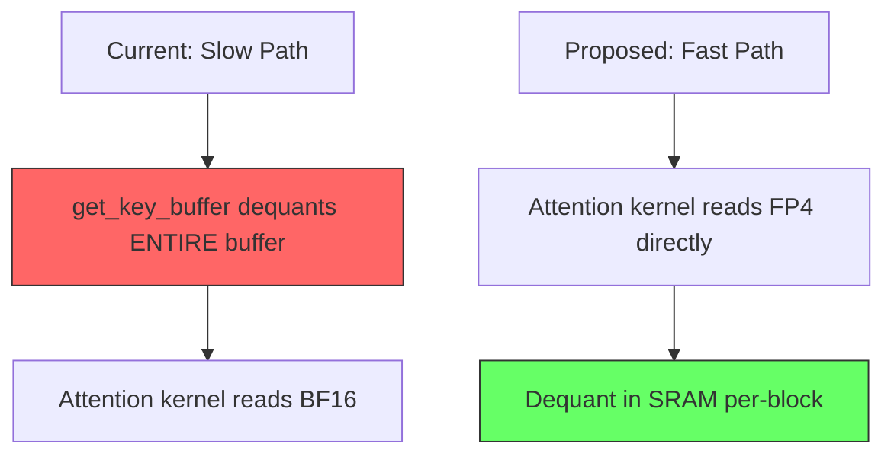

# Plan: Fast FP4 KV Cache Decode

## Goal
Eliminate the ~50% throughput drop when using `--kv-cache-dtype fp4_e2m1` by avoiding full-buffer software dequantization on every decode step.

## CUDA Graph Constraints

After analyzing the CUDA graph flow in sglang:

1. **Capture**: [`capture_one_batch_size()`](python/sglang/srt/model_executor/cuda_graph_runner.py:563) runs the full model forward including [`forward_decode()`](python/sglang/srt/layers/attention/flashinfer_mla_backend.py:595) which calls [`get_key_buffer()`](python/sglang/srt/mem_cache/memory_pool.py:1640)
2. **Replay**: [`replay()`](python/sglang/srt/model_executor/cuda_graph_runner.py:877) first calls `replay_prepare()` which updates `kv_indices` OUTSIDE the graph, then replays the captured graph
3. The `get_key_buffer()` → `batched_dequantize()` call IS inside the captured graph
4. `@torch.compile` decorated functions work inside CUDA graphs — they compile to fused kernels that operate on fixed buffer pointers

**Key constraint**: Any solution must work with CUDA graph capture/replay. Dynamic operations like `torch.unique()` or variable-length indexing are NOT allowed inside the captured graph.

## Revised Approach Analysis

### Approach A: Selective Dequant in `forward_decode` — NOT VIABLE
- `torch.unique()` and dynamic indexing don't work in CUDA graphs
- The `kv_indices` are updated before replay but the graph operations are fixed
- Would need fixed-size scratch buffers, defeating the purpose

### Approach B: Fused Triton Decode Kernel with FP4 — BEST APPROACH

**This is the only approach that truly solves the problem.** Instead of dequantizing the KV cache before the attention kernel, we modify the attention kernel itself to read FP4 data and dequantize on-the-fly in SRAM.



**Why this works with CUDA graphs:**
- The triton kernel reads from fixed buffer pointers (FP4 buffer + scale buffer)
- No dynamic shapes — the kernel processes whatever `kv_indices` point to
- The `kv_indices` are updated before replay via `init_forward_metadata_replay_cuda_graph`
- The kernel only reads the tokens it needs (via `kv_indices`), not the entire buffer

### Approach C: Pre-allocated Scratch Buffer Dequant — PARTIAL FIX

Instead of `batched_dequantize` creating a new tensor, use a pre-allocated BF16 scratch buffer. This doesn't reduce the amount of dequantization work, but eliminates memory allocation overhead and ensures CUDA graph compatibility.

**This is already what happens** — inside a CUDA graph, the tensor allocation from `batched_dequantize` is captured and reused. So this approach provides no benefit.

## Implementation Plan: Fused FP4 Triton Decode Kernel

### For MHA Models (MiniMax M2.5) — Triton Backend

The triton decode kernel at [`decode_attention.py`](python/sglang/srt/layers/attention/triton_ops/decode_attention.py) already uses `kv_indices` for selective token loading. We modify it to:

1. Accept FP4 packed buffers + scale buffers instead of BF16 buffers
2. Dequantize FP4 → FP32 in registers after loading from HBM
3. Continue with normal attention computation

#### Step 1: New Triton Kernel `_fwd_kernel_stage1_fp4`

```python
@triton.jit
def _fwd_kernel_stage1_fp4(
    Q, K_Buffer_FP4, K_Scale_Buffer, V_Buffer_FP4, V_Scale_Buffer,
    sm_scale, kv_indptr, kv_indices,
    Att_Out, Att_Lse, num_kv_splits,
    # Strides for Q
    stride_qbs, stride_qh,
    # Strides for K FP4 buffer: [total_tokens, num_heads, head_dim//2]
    stride_buf_kbs, stride_buf_kh,
    # Strides for K scale buffer: [total_tokens, num_heads * head_dim // 16]
    stride_scale_kbs,
    # Strides for V (same layout as K)
    stride_buf_vbs, stride_buf_vh,
    stride_scale_vbs,
    # Strides for output
    stride_mid_ob, stride_mid_oh, stride_mid_os,
    kv_group_num: tl.constexpr,
    BLOCK_DMODEL: tl.constexpr,
    BLOCK_DV: tl.constexpr,
    BLOCK_N: tl.constexpr,
    MIN_BLOCK_KV: tl.constexpr,
    logit_cap: tl.constexpr,
    Lk: tl.constexpr,
    Lv: tl.constexpr,
    SCALE_BLOCK_SIZE: tl.constexpr,  # 16 for MXFP4
):
    cur_batch = tl.program_id(0)
    cur_head = tl.program_id(1)
    split_kv_id = tl.program_id(2)
    cur_kv_head = cur_head // kv_group_num

    # ... same setup as original kernel ...

    for start_n in range(split_kv_start, split_kv_end, BLOCK_N):
        offs_n = start_n + tl.arange(0, BLOCK_N)
        kv_loc = tl.load(kv_indices + cur_batch_kv_start_idx + offs_n,
                         mask=offs_n < split_kv_end, other=0)

        # === FP4 DEQUANTIZATION ===
        # Load packed FP4 data (2 values per byte, so head_dim//2 bytes)
        offs_d_half = tl.arange(0, BLOCK_DMODEL // 2)
        offs_buf_k_fp4 = (kv_loc[:, None] * stride_buf_kbs
                         + cur_kv_head * stride_buf_kh
                         + offs_d_half[None, :])
        k_packed = tl.load(K_Buffer_FP4 + offs_buf_k_fp4,
                          mask=(offs_n[:, None] < split_kv_end),
                          other=0).to(tl.uint8)

        # Unpack: low nibble = even indices, high nibble = odd indices
        k_lo = (k_packed & 0x0F)  # [BLOCK_N, BLOCK_DMODEL//2]
        k_hi = ((k_packed >> 4) & 0x0F)

        # E2M1 dequantization: sign(1bit) + magnitude(3bits)
        # Magnitude lookup: [0, 0.5, 1, 1.5, 2, 3, 4, 6]
        k_lo_sign = ((k_lo & 0x08) != 0).to(tl.float32) * -2.0 + 1.0
        k_lo_mag = (k_lo & 0x07).to(tl.float32)  # 0-7 index
        # ... apply E2M1 lookup table via arithmetic ...

        # Load scale factors (1 per 16 elements)
        scale_idx = (kv_loc[:, None] * (Lk // SCALE_BLOCK_SIZE)
                    + offs_d[None, :] // SCALE_BLOCK_SIZE)
        k_scales_raw = tl.load(K_Scale_Buffer + scale_idx, ...)
        k_scales = tl.exp2(k_scales_raw.to(tl.float32) - 127.0)

        # Apply scales and interleave
        k_even = k_lo_dequant * k_scales_even  # [BLOCK_N, BLOCK_DMODEL//2]
        k_odd = k_hi_dequant * k_scales_odd

        # Interleave to get full k: [BLOCK_N, BLOCK_DMODEL]
        k = interleave(k_even, k_odd)

        # Normal attention computation
        qk = tl.sum(q[None, :] * k, 1)
        qk *= sm_scale
        # ... rest unchanged ...
```

#### Step 2: Wrapper Function

```python
def decode_attention_fwd_fp4(
    q, k_buffer_fp4, k_scale_buffer, v_buffer_fp4, v_scale_buffer,
    o, kv_indptr, kv_indices, attn_logits, attn_lse,
    num_kv_splits, max_kv_splits, sm_scale, logit_cap=0.0,
):
    """Decode attention with FP4 KV cache - no dequantization needed."""
    # ... launch _fwd_kernel_stage1_fp4 ...
    # ... then _decode_softmax_reducev_fwd_fp4 for V ...
```

#### Step 3: Backend Integration

Modify [`triton_backend.py:forward_decode()`](python/sglang/srt/layers/attention/triton_backend.py:997):

```python
def forward_decode(self, q, k, v, layer, forward_batch, save_kv_cache=True, ...):
    # ... existing save_kv_cache logic ...

    pool = forward_batch.token_to_kv_pool
    if hasattr(pool, 'is_fp4') and pool.is_fp4:
        # Use FP4-native kernel
        k_fp4, k_scales = pool.get_key_buffer_raw(layer.layer_id)
        v_fp4, v_scales = pool.get_value_buffer_raw(layer.layer_id)
        self.decode_attention_fwd_fp4(
            q, k_fp4, k_scales, v_fp4, v_scales, o,
            kv_indptr, kv_indices, ...
        )
    else:
        # Existing path
        self.decode_attention_fwd(q, k_buffer, v_buffer, o, ...)
```

#### Step 4: Memory Pool Changes

Add to [`MHATokenToKVPoolFP4`](python/sglang/srt/mem_cache/memory_pool.py:1040) and [`MLATokenToKVPoolFP4`](python/sglang/srt/mem_cache/memory_pool.py:1601):

```python
@property
def is_fp4(self):
    return self.store_dtype != self.dtype

def get_key_buffer_raw(self, layer_id):
    """Return raw FP4 data and scales without dequantization."""
    return (
        self.k_buffer[layer_id - self.start_layer],  # or kv_buffer for MLA
        self.k_scale_buffer[layer_id - self.start_layer],  # or kv_scale_buffer
    )

def get_value_buffer_raw(self, layer_id):
    """Return raw FP4 data and scales without dequantization."""
    return (
        self.v_buffer[layer_id - self.start_layer],
        self.v_scale_buffer[layer_id - self.start_layer],
    )
```

### For MLA Models (Kimi K2.5) — FlashInfer Backend

The FlashInfer MLA backend uses `BatchMLAPagedAttentionWrapper.run()` which is a C++ kernel that expects a contiguous BF16/FP8 buffer. We cannot modify this kernel without upstream changes.

**Options for MLA:**

#### Option A: Write a Triton MLA Decode Kernel with FP4

Create a new triton kernel specifically for MLA decode that:
- Reads the MLA KV buffer in FP4 format
- Dequantizes on-the-fly
- Computes MLA attention (q_nope × k_nope + q_rope × k_rope)

This is more complex than the MHA kernel because MLA has the split nope/rope structure, but the principle is the same.

#### Option B: Use `trtllm_mla` Backend + Modify to Pass FP4 Natively

The TRT-LLM MLA kernel already handles FP8 natively. If we can modify the Python wrapper to pass FP4 data with scale factors, the C++ kernel might be able to handle it (or we'd need to modify the C++ side too).

#### Option C: Triton-based MLA Decode with FP4 (Recommended)

Write a triton kernel that implements MLA decode attention with FP4 KV cache. The MLA decode is simpler than MHA because there's only 1 KV head (the latent representation):

```python
@triton.jit
def _mla_decode_fp4_kernel(
    Q_nope, Q_rope,  # [bs, num_q_heads, v_head_dim] and [bs, num_q_heads, rope_dim]
    KV_Buffer_FP4,    # [total_tokens, 1, kv_cache_dim // 2] packed uint8
    KV_Scale_Buffer,  # [total_tokens, kv_cache_dim // 16] uint8
    kv_indptr, kv_indices,
    Output,
    sm_scale,
    v_head_dim: tl.constexpr,  # 512 for DeepSeek
    rope_dim: tl.constexpr,    # 64
    ...
):
    # Load Q
    q_nope = tl.load(Q_nope + ...)  # [num_q_heads, v_head_dim]
    q_rope = tl.load(Q_rope + ...)  # [num_q_heads, rope_dim]

    for start_n in range(split_kv_start, split_kv_end, BLOCK_N):
        kv_loc = tl.load(kv_indices + ...)

        # Load FP4 KV and dequantize
        kv_fp4 = tl.load(KV_Buffer_FP4 + kv_loc * stride + ...)
        kv_scales = tl.load(KV_Scale_Buffer + kv_loc * scale_stride + ...)
        kv = fp4_dequant(kv_fp4, kv_scales)  # [BLOCK_N, kv_cache_dim]

        # Split into nope and rope parts
        k_nope = kv[:, :v_head_dim]    # [BLOCK_N, 512]
        k_rope = kv[:, v_head_dim:]    # [BLOCK_N, 64]

        # Compute attention scores
        # score = q_nope @ k_nope.T + q_rope @ k_rope.T
        score_nope = tl.sum(q_nope[None, :] * k_nope, 1)
        score_rope = tl.sum(q_rope[None, :] * k_rope, 1)
        qk = (score_nope + score_rope) * sm_scale

        # Online softmax + accumulate
        # ... standard flash attention reduction ...
```

## Implementation Order

### Step 1: MHA FP4 Triton Kernel (MiniMax M2.5)
Files to modify:
- [`python/sglang/srt/layers/attention/triton_ops/decode_attention.py`](python/sglang/srt/layers/attention/triton_ops/decode_attention.py) — New `_fwd_kernel_stage1_fp4` and `_decode_softmax_reducev_fwd_fp4`
- [`python/sglang/srt/layers/attention/triton_backend.py`](python/sglang/srt/layers/attention/triton_backend.py) — FP4 dispatch in `forward_decode()`
- [`python/sglang/srt/mem_cache/memory_pool.py`](python/sglang/srt/mem_cache/memory_pool.py) — `get_key_buffer_raw()`, `is_fp4` property

### Step 2: MLA FP4 Triton Kernel (Kimi K2.5)
Files to modify:
- New file: `python/sglang/srt/layers/attention/triton_ops/mla_decode_fp4.py` — MLA-specific FP4 decode kernel
- [`python/sglang/srt/layers/attention/flashinfer_mla_backend.py`](python/sglang/srt/layers/attention/flashinfer_mla_backend.py) — FP4 dispatch in `forward_decode()`
- [`python/sglang/srt/mem_cache/memory_pool.py`](python/sglang/srt/mem_cache/memory_pool.py) — `get_key_buffer_raw()` for MLA FP4 pool

### Step 3: Testing and Validation
- Correctness: Compare FP4 kernel output vs BF16 reference
- Performance: Benchmark decode throughput with FP4 vs BF16
- CUDA graph: Verify capture/replay works correctly

## Performance Expectations

The FP4 triton kernel should be **faster than BF16** for decode because:
- **4x less HBM bandwidth**: Read 288 bytes/token instead of 1152 bytes/token
- **Decode is memory-bandwidth bound**: The bottleneck is reading KV cache from HBM, not compute
- **Dequantization is compute-bound in SRAM**: Essentially free compared to HBM reads
- **Only reads active tokens**: Via `kv_indices`, not the entire buffer

Expected speedup: **1.5-2x faster than BF16 decode** (due to 4x less memory bandwidth, partially offset by dequant compute).

## Risk Assessment

| Risk | Mitigation |
|------|-----------|
| Triton FP4 dequant correctness | Unit test against PyTorch reference implementation |
| E2M1 lookup table in Triton | Use arithmetic approximation instead of table lookup |
| CUDA graph compatibility | Test with `--disable-cuda-graph` first, then enable |
| MLA kernel complexity | Start with MHA kernel, port to MLA after validation |
| Performance regression | Benchmark against BF16 baseline before deploying |
