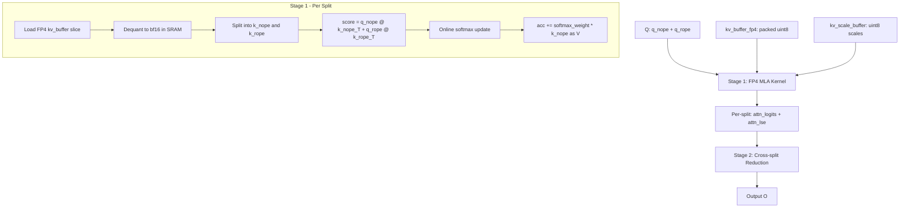

# MLA FP4 Triton Decode Kernel Plan

## Background

Kimi K2.5 (DeepSeek-V3 architecture) uses **Multi-head Latent Attention (MLA)** with FP4 KV cache. Currently, the decode path in `flashinfer_mla_backend.py` calls `get_key_buffer()` which triggers a **full software dequantization** of the entire KV buffer before passing it to the FlashInfer C++ MLA kernel. This is the same pattern we fixed for MHA in Step 1.

## MLA vs MHA: Key Differences

### MHA (MiniMax M2.5 — Step 1, DONE)
- Separate K and V buffers: `k_buffer[total_tokens, num_kv_heads, head_dim//2]` + `v_buffer[...]`
- Standard multi-head attention: `softmax(Q @ K^T / sqrt(d)) @ V`
- Our fused FP4 kernel reads packed K/V directly, dequantizes in SRAM

### MLA (Kimi K2.5 — Step 2, THIS PLAN)
- **Single compressed KV buffer**: `kv_buffer[total_tokens, 1, kv_cache_dim//2]` uint8
- `kv_cache_dim = kv_lora_rank + qk_rope_head_dim` (typically 512 + 64 = 576)
- The buffer stores `[c_kv_nope | k_rope]` concatenated
- **Absorbed attention**: Q is pre-projected so `q_nope @ c_kv_nope^T` gives attention scores
- V is derived from the same `c_kv_nope` latent (no separate V buffer)
- Scale buffer: `kv_scale_buffer[total_tokens, kv_cache_dim // 16]` uint8

### The MLA Decode Computation

```
# Current flow (flashinfer_mla_backend.py:595-653):
q_nope = q[:, :, :v_head_dim]        # [bs, num_q_heads, v_head_dim=512]
q_rope = q[:, :, v_head_dim:]         # [bs, num_q_heads, rope_dim=64]

k_buffer = get_key_buffer(layer_id)   # DEQUANT HERE: [total_tokens, 1, 576] -> bf16
k_nope = k_buffer[:, :, :v_head_dim]  # [total_tokens, 1, 512]
k_rope = k_buffer[:, :, v_head_dim:]  # [total_tokens, 1, 64]

# FlashInfer MLA kernel computes:
# scores = q_nope @ k_nope^T + q_rope @ k_rope^T  (split attention)
# output = softmax(scores * sm_scale) @ k_nope[:, :, :v_head_dim]
# Note: In MLA, V = k_nope (the compressed latent IS the value)
```

## Approach: Fused Triton MLA FP4 Decode Kernel

**Yes, we can write this entirely in Triton.** The MLA decode kernel is structurally similar to our MHA FP4 kernel, with these modifications:

1. **Single KV buffer** instead of separate K and V
2. **Split Q dot product**: `score = q_nope @ k_nope^T + q_rope @ k_rope^T`
3. **V = k_nope** (reuse the same dequantized nope portion for value accumulation)

### Architecture



### Key Design Decisions

#### 1. Single buffer dequant + split
The FP4 KV buffer stores `[c_kv_nope | k_rope]` concatenated. We dequantize the full 576-dim vector, then split:
- `k_nope = dequant[:v_head_dim]` (first 512 dims) — used for both score AND value
- `k_rope = dequant[v_head_dim:]` (last 64 dims) — used only for score

#### 2. Score computation
```python
# For each token in the KV split:
score = tl.sum(q_nope * k_nope, axis=-1) + tl.sum(q_rope * k_rope, axis=-1)
score *= sm_scale
```

#### 3. Value accumulation
In MLA, the value IS the k_nope portion. So after computing softmax weights:
```python
acc += softmax_weight * k_nope  # k_nope serves as V
```

#### 4. Output dimension
Output is `[bs, num_q_heads, v_head_dim]` where `v_head_dim = kv_lora_rank = 512`.

### Kernel Parameters

```python
def decode_attention_fwd_fp4_mla(
    q_nope,           # [batch, num_q_heads, v_head_dim=512]
    q_rope,           # [batch, num_q_heads, rope_dim=64]
    kv_buffer_fp4,    # [total_tokens, 1, kv_cache_dim//2] uint8
    kv_scale_buffer,  # [total_tokens, kv_cache_dim//16] uint8
    o,                # [batch, num_q_heads, v_head_dim] output
    kv_indptr,        # [batch + 1] int32
    kv_indices,       # [total_kv_tokens] int32
    attn_logits,      # [batch, num_q_heads, max_kv_splits, v_head_dim] scratch
    attn_lse,         # [batch, num_q_heads, max_kv_splits] scratch
    num_kv_splits,    # [batch] int32
    max_kv_splits,    # int
    sm_scale,         # float
    v_head_dim,       # int (512 for DeepSeek-V3)
    rope_dim,         # int (64 for DeepSeek-V3)
    logit_cap=0.0,
):
```

### Triton Grid

```python
# Same 2-stage approach as MHA FP4:
# Stage 1: grid = (batch, num_q_heads, max_kv_splits)
# Stage 2: grid = (batch, num_q_heads) — reuse existing _fwd_kernel_stage2
```

### Tiling Strategy

The main challenge is that `kv_cache_dim = 576` which is not a power of 2. We handle this by:
- `BLOCK_KV_DIM = 576` (or next power of 2 = 1024 with masking)
- Better: tile the dequant in chunks of 16 (FP4 block size), process 576/16 = 36 blocks
- The q_nope dot product uses first 512 dims, q_rope uses last 64 dims

Actually, since we dequant per-token and the KV dim is moderate (576), we can:
1. Load the full 576/2 = 288 bytes of packed FP4 per token
2. Load 576/16 = 36 scale bytes
3. Dequant all 576 values in registers
4. Split: first 512 for nope, last 64 for rope
5. Compute both dot products

### Comparison with MHA FP4 Kernel

| Aspect | MHA FP4 (Step 1) | MLA FP4 (Step 2) |
|--------|-------------------|-------------------|
| KV buffers | 2 separate (K, V) | 1 combined |
| KV heads | num_kv_heads (e.g., 8) | 1 (compressed) |
| Head dim | 128 typical | 576 (512+64) |
| Score | `q @ k^T` | `q_nope @ k_nope^T + q_rope @ k_rope^T` |
| Value | Separate V buffer | k_nope portion of same buffer |
| Output dim | head_dim | v_head_dim (512) |
| GQA ratio | kv_group_num | num_q_heads (all share 1 KV head) |

### Memory Bandwidth Savings

Per token per layer:
- **Current (dequant all)**: Read 288B FP4 + 36B scales → dequant to 1152B bf16 → write to scratch → read again by FlashInfer
- **Fused FP4**: Read 288B FP4 + 36B scales → dequant in SRAM → compute directly
- **Savings**: Eliminates 1152B write + 1152B read = **2304B per token per layer**
- For 100K context, 60 layers: `100K × 60 × 2304B = ~13.8 GB` of saved HBM traffic

## Implementation Plan

### File Changes

1. **`python/sglang/srt/layers/attention/triton_ops/decode_attention_fp4.py`**
   - Add `_fwd_kernel_stage1_fp4_mla()` Triton kernel
   - Add `_decode_att_m_fwd_fp4_mla()` launcher
   - Add `decode_attention_fwd_fp4_mla()` top-level function

2. **`python/sglang/srt/mem_cache/memory_pool.py`**
   - Add `is_fp4 = True` to `MLATokenToKVPoolFP4`
   - Add `get_kv_buffer_raw(layer_id)` → returns `(kv_fp4, kv_scale)` tuple

3. **`python/sglang/srt/layers/attention/flashinfer_mla_backend.py`**
   - In `forward_decode()`: detect `getattr(kv_pool, 'is_fp4', False)`
   - When True: call `get_kv_buffer_raw()` and dispatch to fused Triton MLA kernel
   - Bypass FlashInfer C++ MLA wrapper entirely for decode

4. **`python/sglang/srt/layers/attention/triton_ops/test_decode_attention_fp4_mla.py`**
   - Correctness test: compare fused FP4 MLA vs software dequant + reference
   - Benchmark: fused vs dequant+FlashInfer

### Stage 1 Kernel Pseudocode

```python
@triton.jit
def _fwd_kernel_stage1_fp4_mla(
    Q_nope, Q_rope,
    KV_fp4, KV_scale,
    Att_logits, Att_lse,
    kv_indptr, kv_indices,
    ...
    V_HEAD_DIM: tl.constexpr,  # 512
    ROPE_DIM: tl.constexpr,    # 64
    KV_CACHE_DIM: tl.constexpr,  # 576
    BLOCK_KV_TOKENS: tl.constexpr,  # e.g., 64
):
    batch_id = tl.program_id(0)
    head_id = tl.program_id(1)
    split_id = tl.program_id(2)
    
    # Load q_nope [V_HEAD_DIM] and q_rope [ROPE_DIM]
    q_nope = tl.load(Q_nope + ...)  # [V_HEAD_DIM]
    q_rope = tl.load(Q_rope + ...)  # [ROPE_DIM]
    
    # Online softmax accumulators
    m_prev = -float('inf')
    l_prev = 0.0
    acc = tl.zeros([V_HEAD_DIM], dtype=tl.float32)
    
    # Iterate over KV tokens in this split
    for token_idx in range(split_start, split_end, BLOCK_KV_TOKENS):
        for t in range(BLOCK_KV_TOKENS):
            # Load and dequant FP4 KV for this token
            kv_full = load_and_dequant_fp4(KV_fp4, KV_scale, token_pos, KV_CACHE_DIM)
            
            # Split into nope and rope
            k_nope = kv_full[:V_HEAD_DIM]   # first 512
            k_rope = kv_full[V_HEAD_DIM:]   # last 64
            
            # Compute attention score
            score = tl.sum(q_nope * k_nope) + tl.sum(q_rope * k_rope)
            score *= sm_scale
            
            # Online softmax
            m_new = tl.maximum(m_prev, score)
            exp_prev = tl.exp(m_prev - m_new)
            exp_cur = tl.exp(score - m_new)
            l_new = l_prev * exp_prev + exp_cur
            
            # Update accumulator (V = k_nope)
            acc = acc * (l_prev * exp_prev / l_new) + k_nope * (exp_cur / l_new)
            
            m_prev = m_new
            l_prev = l_new
    
    # Store results for stage 2
    tl.store(Att_logits + ..., acc)
    tl.store(Att_lse + ..., m_prev + tl.log(l_prev))
```

### Key Optimization Notes

1. **Register pressure**: 576 dims is large. We may need to tile the dot product:
   - Process k_nope in chunks of 128 for the dot product
   - Process k_rope (64 dims) in one shot
   - Accumulate V (512 dims) in chunks

2. **FP4 dequant reuse**: Each token's FP4 data is dequanted once and used for both score AND value accumulation

3. **num_kv_heads = 1**: MLA has only 1 KV head, so all Q heads share the same KV. The grid parallelizes over Q heads, but each loads the same KV data. This is actually good for L2 cache reuse.

4. **CUDA graph compatible**: Same as MHA FP4 — all shapes are static, no dynamic allocation.

## Risk Assessment

- **Low risk**: The kernel structure is identical to our proven MHA FP4 kernel
- **Medium risk**: Register pressure from 576-dim vectors (may need tiling)
- **Low risk**: Integration is straightforward — same pattern as MHA FP4 integration
- **Expected speedup**: Similar to MHA (3-4x) since the bottleneck is the same (HBM bandwidth for dequant)
