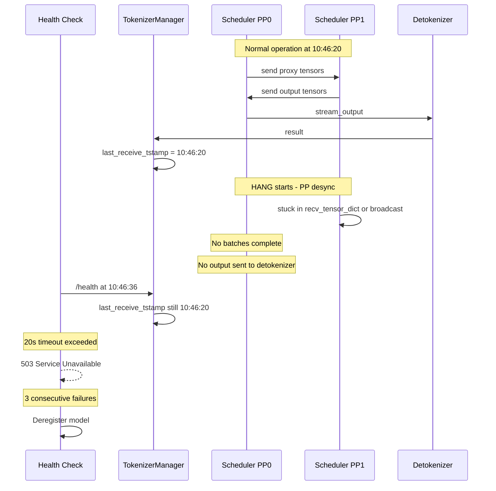

# PP Health Check Hang Fix Plan

## Problem Summary

The Kimi-K2.5 deployment with `pp_size=4`, `tp_size=8`, `nnodes=4` intermittently hangs under load, causing health check failures and service deregistration.

## Root Cause Analysis

### Symptom Chain



### Root Cause: PP Desynchronization in `recv_requests` Broadcast

The pyspy dump from node1 PP1 TP4 shows the scheduler stuck in:
```
c10d::Work::wait -> broadcast (torch/distributed/distributed_c10d.py:2841)
```

This is the **TP broadcast inside `recv_requests`** at [`scheduler.py`](python/sglang/srt/managers/scheduler.py:1319):

```python
elif self.tp_size != 1:
    recv_reqs = broadcast_pyobj(
        recv_reqs,
        self.tp_group.rank,
        self.tp_cpu_group,
        src=self.tp_group.ranks[0],
    )
```

The hang occurs because:

1. **PP0 TP0** receives requests from the tokenizer via ZMQ and broadcasts to other TP ranks
2. **PP1+ TP0** receives requests from PP0 via `point_to_point_pyobj`, then broadcasts to other TP ranks
3. If PP0 sends requests to PP1 but PP1 TP0 is still processing a previous batch while other TP ranks on PP1 are already waiting in `broadcast_pyobj`, a **deadlock** can occur

The specific scenario:
- PP1 TP0 is busy with a long-running forward pass or output processing
- PP1 TP4 and other non-zero TP ranks finish their work and enter `recv_requests` -> `broadcast_pyobj` waiting for TP0
- PP1 TP0 is stuck in a different collective operation or is delayed
- Since `broadcast_pyobj` uses `dist.broadcast` which is **blocking with no timeout**, all TP ranks on PP1 hang indefinitely

### Contributing Factors

1. **High token usage at 49%** with large batches of ~370K tokens - forward passes take significant time
2. **`pp_async_batch_depth=1`** means there is overlap between batch processing and communication, increasing desync risk
3. **No timeout on distributed operations** - `recv_tensor_dict`, `broadcast_pyobj`, and `point_to_point_pyobj` all block indefinitely
4. **Health check timeout is only 20 seconds** - too short for PP recovery under heavy load
5. **`broadcast_pyobj` uses CPU gloo backend** which can be slow under CPU contention from large batch serialization

## Fix Plan

### Fix 1: Quick Config Fix - Increase Health Check Timeout and Watchdog

**File:** [`../entrypoint.sh`](../entrypoint.sh:78)

Changes:
- Set `SGLANG_HEALTH_CHECK_TIMEOUT=120` environment variable to increase from 20s to 120s
- Increase `--watchdog-timeout` from default 300 to 600 for PP workloads
- Add `--dist-timeout 600` to increase torch.distributed timeout
- Increase `--soft-watchdog-timeout` from 120 to 300

This is the most impactful immediate fix. The 20s default health check timeout is far too aggressive for a 4-node PP deployment where a single forward pass through all 4 stages can take several seconds, and batch processing with ~370K tokens can take 10+ seconds.

### Fix 2: Quick Config Fix - Reduce pp_async_batch_depth to 0

**File:** [`../entrypoint.sh`](../entrypoint.sh:78)

Change `--pp-async-batch-depth 1` to `--pp-async-batch-depth 0`. The async batch depth of 1 adds complexity to the PP communication pattern by overlapping output processing with the next batch launch. This increases the window for desync. Setting it to 0 makes the PP loop strictly sequential, which is more robust at the cost of slightly lower throughput.

### Fix 3: Code Fix - Add Timeout to PP recv_tensor_dict

**File:** [`python/sglang/srt/distributed/parallel_state.py`](python/sglang/srt/distributed/parallel_state.py:1257)

The `recv_tensor_dict` method uses `irecv` + `work.wait()` with no timeout. Add a configurable timeout so that a stuck recv does not block forever:

- In `recv_object`: add timeout parameter to `work.wait()`
- In `recv_tensor_dict`: propagate timeout and return `None` on timeout
- In `_pp_recv_proxy_tensors`: handle `None` return gracefully - already has this logic

### Fix 4: Code Fix - Add Timeout to broadcast_pyobj

**File:** [`python/sglang/srt/utils/common.py`](python/sglang/srt/utils/common.py:1268)

The `broadcast_pyobj` function uses `dist.broadcast` which blocks indefinitely. Change to use `async_op=True` with `work.wait(timeout=...)` to allow timeout-based recovery.

### Fix 5: Code Fix - PP Event Loop Desync Recovery

**File:** [`python/sglang/srt/managers/scheduler_pp_mixin.py`](python/sglang/srt/managers/scheduler_pp_mixin.py:47)

Add a watchdog-style check in the PP event loop that detects when a microbatch iteration takes too long and attempts recovery:

1. Track time per microbatch iteration
2. If an iteration exceeds a threshold, log detailed state and attempt to skip the stuck operation
3. Send a sentinel/empty batch to downstream PP stages to unblock them

### Fix 6: Code Fix - Auto-scale Health Check Timeout for PP

**File:** [`python/sglang/srt/entrypoints/http_server.py`](python/sglang/srt/entrypoints/http_server.py:160)

When PP is enabled, the default health check timeout should be higher since PP adds communication overhead:

```python
# Current: HEALTH_CHECK_TIMEOUT = int(os.getenv("SGLANG_HEALTH_CHECK_TIMEOUT", 20))
# Proposed: scale with PP size
default_timeout = 20 if server_args.pp_size <= 1 else 20 * server_args.pp_size
HEALTH_CHECK_TIMEOUT = int(os.getenv("SGLANG_HEALTH_CHECK_TIMEOUT", default_timeout))
```

## Implementation Priority

### Immediate - Config Changes Only - Apply Now
1. **Fix 1**: Set `SGLANG_HEALTH_CHECK_TIMEOUT=120`, `--dist-timeout 600`, `--watchdog-timeout 600`, `--soft-watchdog-timeout 300`
2. **Fix 2**: Set `--pp-async-batch-depth 0`

### Short-term - Code Changes
3. **Fix 6**: Auto-scale health check timeout for PP
4. **Fix 3**: Add timeout to `recv_tensor_dict` and `recv_object`
5. **Fix 4**: Add timeout to `broadcast_pyobj`

### Medium-term - Code Changes
6. **Fix 5**: PP event loop desync recovery

## Recommended entrypoint.sh Changes

```bash
# Add these environment variables before the python3 command
export SGLANG_HEALTH_CHECK_TIMEOUT=120
export NCCL_TIMEOUT=600

python3 -m sglang.launch_server \
    --host 0.0.0.0 \
    --model "${MODEL_DIR}" \
    --tokenizer-path "${MODEL_DIR}" \
    --sampling-defaults model \
    --api-key danucore \
    --context-length 256000 \
    --chunked-prefill-size 4096 \
    --max-prefill-tokens 16384 \
    --soft-watchdog-timeout 300 \          # was 120
    --watchdog-timeout 600 \               # was default 300
    --dist-timeout 600 \                   # NEW - torch.distributed timeout
    --mem-fraction-static 0.85 \
    --enable-metrics \
    --tp-size 8 \
    --ep-size 1 \
    --dp-size 1 \
    --pp-size 4 \
    --pp-async-batch-depth 0 \             # was 1 - reduce desync risk
    --max-running-requests 64 \
    --enable-cache-report \
    --cpu-offload-gb 0 \
    --served-model-name "${MODEL_PATH}" \
    --trust-remote-code \
    --disable-shared-experts-fusion \
    --attention-backend flashinfer \
    --moe-runner-backend triton \
    --fp8-gemm-backend cutlass \
    --schedule-policy lpm \
    --schedule-conservativeness 2.0 \
    --kv-cache-dtype bf16 \
    --page-size 1 \
    --tool-call-parser kimi_k2 \
    --reasoning-parser kimi_k2 \
    --chat-template "${MODEL_DIR}/chat_template.jinja" \
    --port "${HOST_PORT}" \
    --dist-init-addr "${DIST_INIT_ADDR}" \
    --nnodes "${NNODES}" \
    --node-rank "${NODE_RANK}" &
```

## Key Differences from Current Config

| Parameter | Current | Proposed | Reason |
|-----------|---------|----------|--------|
| `SGLANG_HEALTH_CHECK_TIMEOUT` | 20s default | 120s | PP adds multi-stage latency; 20s too aggressive |
| `--soft-watchdog-timeout` | 120 | 300 | More headroom before debug dump |
| `--watchdog-timeout` | 300 default | 600 | Prevent premature crash during PP stalls |
| `--dist-timeout` | not set | 600 | Prevent torch.distributed from timing out |
| `--pp-async-batch-depth` | 1 | 0 | Eliminate async overlap desync risk |
| `NCCL_TIMEOUT` | not set | 600 | Prevent NCCL collective timeouts |
