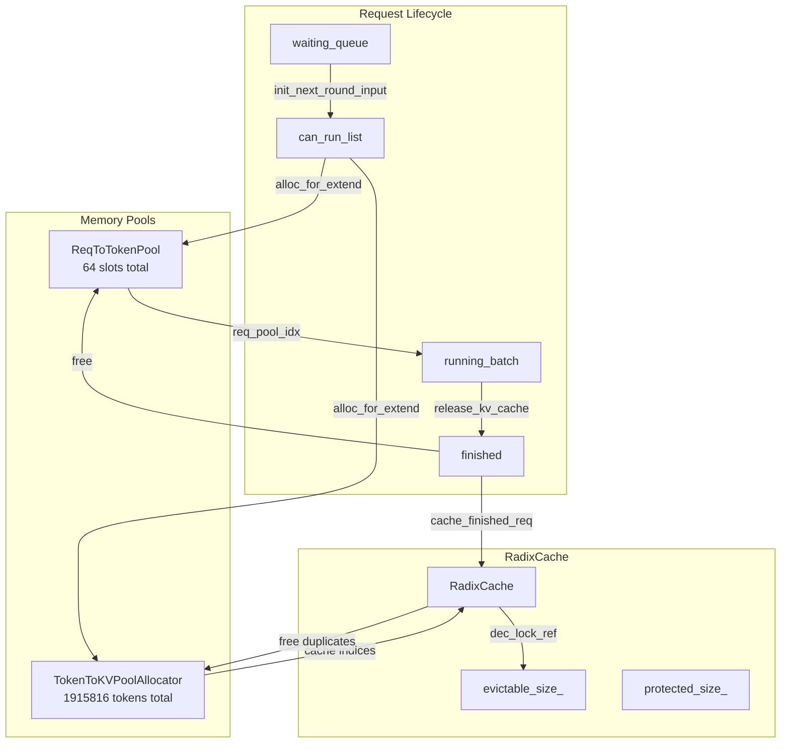

# PP Memory Leak Investigation and Fix Plan

## Status: Root Cause Identified

**Date:** 2026-02-26

## Problem Summary

Memory leaks are detected in SGLang's Pipeline Parallelism (PP) mode:

```
req_to_token_pool memory leak detected! available_size=57, total_size=64
token_to_kv_pool_allocator memory leak detected! self.max_total_num_tokens=1915816, available_size=1835128, evictable_size=52280, protected_size=26360
```

**Leak Amounts:**
- **7 request slots leaked** (64 - 57 = 7)
- **2048 tokens leaked** (1915816 - 1835128 - 52280 - 26360 = 2048)
- Average: ~292 tokens per leaked request

## Memory Management Architecture



## Memory Leak Detection Formula

The idle check in [`scheduler_runtime_checker_mixin.py:150-161`](python/sglang/srt/managers/scheduler_runtime_checker_mixin.py:150) verifies:

```python
available_size + evictable_size + protected_size == max_total_num_tokens
```

If this equation doesn't hold, tokens are leaked.

## Root Cause Analysis

### Hypothesis 1: PP Desync Already Fixed - But Leaks Still Occur

The existing PP desync fix at [`scheduler_pp_mixin.py:99-108`](python/sglang/srt/managers/scheduler_pp_mixin.py:99) handles the case where non-first ranks don't receive proxy tensors:

```python
if not self.pp_group.is_first_rank and pp_proxy_tensors is None:
    for req in self.cur_batch.reqs:
        release_kv_cache(req, self.tree_cache, is_insert=False)
    self.cur_batch = None
    self.mbs[mb_id] = None
```

**However, this fix only handles one specific desync scenario.** The user confirmed leaks still occur after this fix.

### Hypothesis 2: Chunked Prefill Request Leak in PP Mode (LIKELY ROOT CAUSE)

Looking at the PP event loop flow:

1. [`scheduler_pp_mixin.py:91`](python/sglang/srt/managers/scheduler_pp_mixin.py:91): `self.mbs[mb_id] = self.get_next_batch_to_run()`
2. [`scheduler.py:2146`](python/sglang/srt/managers/scheduler.py:2146): `req.init_next_round_input(self.tree_cache)` - Sets `prefix_indices` and `last_node`
3. [`schedule_policy.py:792-794`](python/sglang/srt/managers/schedule_policy.py:792): Request added to `can_run_list` and `_req_inc_lock_ref(req)` called

**Critical Issue:** When `add_one_req` returns early (e.g., `AddReqResult.NO_TOKEN` or `AddReqResult.OTHER`), the request has already called `init_next_round_input` which sets `req.last_node`, but:
- The request is NOT added to `can_run_list`
- `_req_inc_lock_ref` is NOT called
- The request stays in `waiting_queue`

This is normally fine because `init_next_round_input` doesn't allocate any resources - it just matches prefix. **BUT** in PP mode with chunked prefill:

At [`scheduler.py:2094-2098`](python/sglang/srt/managers/scheduler.py:2094):
```python
if self.chunked_req is not None:
    self.chunked_req.init_next_round_input()
    self.chunked_req = adder.add_chunked_req(
        self.chunked_req, truncation_align_size=self.truncation_align_size
    )
```

The `add_chunked_req` function at [`schedule_policy.py:591-620`](python/sglang/srt/managers/schedule_policy.py:591) adds the request to `can_run_list` but **does NOT call `_req_inc_lock_ref`** for chunked requests!

Then at [`scheduler.py:1914-1918`](python/sglang/srt/managers/scheduler.py:1914):
```python
if self.last_batch.chunked_req is not None:
    # In the context pipeline parallelism, after the last chunk, the current microbatch still track outdated chunked_req.
    # We need to discard it.
    chunked_req_to_exclude.add(self.last_batch.chunked_req)
```

**The comment explicitly mentions PP context!** This suggests there's a known issue with chunked requests in PP mode.

### Hypothesis 3: Running Batch Merge Issue in PP Mode

At [`scheduler.py:1931-1938`](python/sglang/srt/managers/scheduler.py:1931):
```python
if not self.last_batch.is_empty() and not self.last_batch.is_prefill_only:
    if self.running_batch.is_empty():
        self.running_batch = self.last_batch
    else:
        # Merge running_batch with prefill batch
        self.running_batch.merge_batch(self.last_batch)
```

In PP mode, `running_batch` and `last_batch` are managed per-microbatch via `running_mbs` and `last_mbs`. If the merge logic doesn't properly account for PP's microbatch structure, requests could be lost.

### Hypothesis 4: self_check_during_idle Doesn't Check waiting_queue

At [`scheduler_runtime_checker_mixin.py:317-335`](python/sglang/srt/managers/scheduler_runtime_checker_mixin.py:317):

```python
def self_check_during_idle(self: Scheduler):
    if self.disaggregation_mode == DisaggregationMode.PREFILL:
        if len(self.disagg_prefill_inflight_queue) > 0:
            return
    elif self.disaggregation_mode == DisaggregationMode.DECODE:
        queue_size = (
            len(self.waiting_queue)
            + len(self.disagg_decode_transfer_queue.queue)
            + len(self.disagg_decode_prealloc_queue.queue)
        )
        # ...
        if queue_size:
            return

    self.check_memory()  # <-- Called even if waiting_queue has requests in non-disagg mode!
```

**For non-disaggregation PP mode, `waiting_queue` is NOT checked before calling `check_memory()`!**

This means if there are requests in `waiting_queue` that have been partially processed (e.g., `init_next_round_input` called but not yet scheduled), the memory check will incorrectly report a leak.

However, this is likely a false positive detection issue, not the actual leak.

## Identified Issues

### Issue 1: Chunked Prefill Doesn't Call inc_lock_ref

**File:** [`schedule_policy.py:591-620`](python/sglang/srt/managers/schedule_policy.py:591)

The `add_chunked_req` function adds requests to `can_run_list` but doesn't call `_req_inc_lock_ref`. This means the tree node's lock reference isn't incremented, so the tokens could be evicted while still in use.

**Fix:** Add `_req_inc_lock_ref` call in `add_chunked_req`.

### Issue 2: PP Microbatch State Tracking

**File:** [`scheduler_pp_mixin.py:75-141`](python/sglang/srt/managers/scheduler_pp_mixin.py:75)

The PP event loop manages multiple microbatches (`mbs`, `last_mbs`, `running_mbs`). When a batch is skipped due to desync, the state might not be properly cleaned up across all tracking arrays.

**Potential Issue:** When `self.mbs[mb_id] = None` is set after desync, but `self.last_mbs[next_mb_id]` might still reference the old batch.

### Issue 3: False Positive in Idle Check for PP Mode

**File:** [`scheduler_runtime_checker_mixin.py:317-335`](python/sglang/srt/managers/scheduler_runtime_checker_mixin.py:317)

The idle check doesn't account for requests in `waiting_queue` for non-disaggregation mode.

## Proposed Fix Plan

### Fix 1: Add inc_lock_ref to add_chunked_req

```python
# In schedule_policy.py, add_chunked_req function
def add_chunked_req(self, req: Req, truncation_align_size: Optional[int] = None):
    # ... existing code ...
    
    req.fill_ids = req.fill_ids[: len(req.prefix_indices) + req.extend_input_len]
    self.can_run_list.append(req)
    
    # ADD THIS: Increment lock reference for chunked requests
    self._req_inc_lock_ref(req)
    
    self._update_prefill_budget(...)
```

### Fix 2: Improve PP Idle Check

```python
# In scheduler_runtime_checker_mixin.py, self_check_during_idle
def self_check_during_idle(self: Scheduler):
    # For PP mode, also check waiting_queue
    if self.pp_size > 1 and len(self.waiting_queue) > 0:
        return
    
    # ... existing disaggregation checks ...
    
    self.check_memory()
```

### Fix 3: Ensure Proper Cleanup on PP Desync

```python
# In scheduler_pp_mixin.py, event_loop_pp
if not self.pp_group.is_first_rank and pp_proxy_tensors is None:
    logger.warning(...)
    for req in self.cur_batch.reqs:
        release_kv_cache(req, self.tree_cache, is_insert=False)
    self.cur_batch = None
    self.mbs[mb_id] = None
    # ADD: Also clear last_mbs to prevent stale references
    if self.last_mbs[mb_id] is not None:
        self.last_mbs[mb_id] = None
```

## Implementation Checklist

- [ ] Investigate `add_chunked_req` to confirm missing `_req_inc_lock_ref` call
- [ ] Add `_req_inc_lock_ref` call to `add_chunked_req` function
- [ ] Update `self_check_during_idle` to check `waiting_queue` for PP mode
- [ ] Review PP desync handling to ensure all state arrays are properly cleaned
- [ ] Add unit tests for PP memory leak scenarios
- [ ] Test with the original reproduction case

## Files to Modify

1. [`python/sglang/srt/managers/schedule_policy.py`](python/sglang/srt/managers/schedule_policy.py) - Add `_req_inc_lock_ref` to `add_chunked_req`
2. [`python/sglang/srt/managers/scheduler_runtime_checker_mixin.py`](python/sglang/srt/managers/scheduler_runtime_checker_mixin.py) - Fix idle check for PP mode
3. [`python/sglang/srt/managers/scheduler_pp_mixin.py`](python/sglang/srt/managers/scheduler_pp_mixin.py) - Improve desync cleanup

## Testing Strategy

1. **Unit Test:** Create a test that simulates PP mode with chunked prefill and verifies no memory leaks
2. **Integration Test:** Run the original benchmark that triggered the leak and verify it's fixed
3. **Stress Test:** Run extended PP workloads to ensure no gradual memory accumulation
