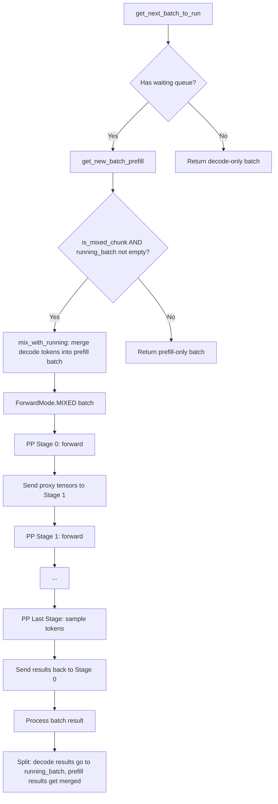

# PP Mixed Chunk + Decode Interleave Plan

## Problem Statement

When running SGLang with Pipeline Parallelism (PP > 1), decode requests are starved by continuous prefill batches. The scheduler at [`get_next_batch_to_run()`](python/sglang/srt/managers/scheduler.py:1880) always prioritizes prefill over decode:

```python
if new_batch is not None:
    ret = new_batch      # Always run prefill if available
else:
    ret = running_batch   # Only decode when no prefill
```

Under sustained load, this means decode batches almost never execute. The logs show gen throughput dropping to 1.82-3.89 token/s with token usage climbing to 0.99 while prefill batches run continuously.

### Why Mixed Chunk is Disabled for PP

The assertion at [`server_args.py:5107-5112`](python/sglang/srt/server_args.py:5107) explicitly blocks mixed chunk with PP:

```python
if self.pp_size > 1:
    assert (
        self.disable_overlap_schedule
        and self.speculative_algorithm is None
        and not self.enable_mixed_chunk
    ), "Pipeline parallelism is not compatible with overlap schedule, speculative decoding, mixed chunked prefill."
```

### Existing PP Decode Guard is Insufficient

The only decode starvation guard at [`scheduler.py:2008-2015`](python/sglang/srt/managers/scheduler.py:2008) only fires when `self.chunked_req is not None` AND `forward_ct % (pp_size + 1) == 0`. If requests complete in a single chunk, this guard never activates.

---

## How TRT-LLM Solves This: Inflight Batching

TRT-LLM uses **inflight batching** where every forward pass contains both prefill and decode tokens in the same batch. Key design principles:

1. **Unified Token Budget**: Each iteration has a `max_num_tokens` budget shared between prefill and decode tokens. Decode tokens always get slots.

2. **Iteration-Level Scheduling**: At every iteration, the scheduler:
   - Includes ALL active decode requests (1 token each)
   - Fills remaining budget with prefill tokens from queued requests
   - This guarantees decode progress every iteration

3. **PP with Inflight Batching**: The same mixed batch flows through all PP stages. Each stage processes the same batch containing both prefill and decode tokens. No special PP handling needed because the batch composition is decided once at the first stage.

4. **No Separate Prefill/Decode Phases**: There is no concept of "prefill batch" vs "decode batch" — every batch is mixed.

---

## Proposed Solution: Two-Phase Approach

### Phase 1: Decode Interleave Counter (Quick Fix)

Add a simple counter-based mechanism to force decode batches periodically, without requiring mixed chunk support.

#### Changes Required

**File: [`scheduler.py`](python/sglang/srt/managers/scheduler.py)**

1. Add a counter `_consecutive_prefill_count` initialized to 0 in [`init_schedule_policy()`](python/sglang/srt/managers/scheduler.py:793)

2. Add a configurable max consecutive prefills parameter (env var `SGLANG_PP_MAX_CONSECUTIVE_PREFILLS`, default = `pp_size`)

3. In [`get_next_batch_to_run()`](python/sglang/srt/managers/scheduler.py:1880), after line 1929 where `new_batch = self.get_new_batch_prefill()`:

```python
# Force decode interleave for PP to prevent decode starvation
if (
    self.pp_size > 1
    and new_batch is not None
    and not self.running_batch.is_empty()
    and self._consecutive_prefill_count >= self._pp_max_consecutive_prefills
):
    self._consecutive_prefill_count = 0
    new_batch = None  # Force decode this iteration
```

4. Increment `_consecutive_prefill_count` when a prefill batch is returned, reset to 0 when decode runs.

**File: [`environ.py`](python/sglang/srt/environ.py)**

Add: `SGLANG_PP_MAX_CONSECUTIVE_PREFILLS = EnvInt(-1)` (default -1 means auto = pp_size)

#### Pros/Cons
- **Pro**: Minimal code change (~20 lines), no architectural risk
- **Pro**: Immediately fixes decode starvation
- **Con**: Suboptimal — decode and prefill still alternate rather than running together
- **Con**: Creates pipeline bubbles during decode-only iterations

---

### Phase 2: Mixed Chunk with PP (Full Solution)

Enable `ForwardMode.MIXED` batches to flow through the PP pipeline, matching TRT-LLM's inflight batching approach.

#### Why Mixed Chunk Was Disabled for PP

After studying the code, the incompatibility stems from these issues:

1. **Overlap Schedule Conflict**: PP requires `disable_overlap_schedule=True`. Mixed chunk was designed to work WITH overlap schedule (the non-PP path). The overlap scheduler processes batch results asynchronously, but PP has its own async result processing via micro-batch pipelining.

2. **Micro-batch State Management**: The PP event loop at [`event_loop_pp()`](python/sglang/srt/managers/scheduler_pp_mixin.py:47) maintains separate `running_mbs[mb_id]` per micro-batch slot. Mixed chunk modifies `running_batch` by merging decode requests into the prefill batch via [`mix_with_running()`](python/sglang/srt/managers/schedule_batch.py:1770), then clears `running_batch`. With PP micro-batches, this state mutation could corrupt other micro-batch slots.

3. **Batch Merge Logic**: After a prefill batch completes, [`get_next_batch_to_run()`](python/sglang/srt/managers/scheduler.py:1917-1924) merges completed prefill requests into `running_batch` for future decode. With mixed chunk, the batch already contains decode requests, so the merge logic needs to handle the mixed case — separating decode results from prefill results.

4. **PP Proxy Tensors**: Each PP stage sends/receives hidden states via [`PPProxyTensors`](python/sglang/srt/model_executor/forward_batch_info.py). The tensor shapes depend on batch composition. Mixed batches have variable-length extend tokens per request, which the PP communication must handle correctly.

#### Architecture for Mixed Chunk + PP



#### Detailed Changes Required

**File: [`server_args.py`](python/sglang/srt/server_args.py:5107-5112)**

Remove the `not self.enable_mixed_chunk` assertion for PP. Replace with a new flag `--enable-pp-mixed-chunk` that enables mixed chunk specifically for PP mode.

**File: [`scheduler.py`](python/sglang/srt/managers/scheduler.py)**

1. **`init_chunked_prefill()`** (line 768): Allow `is_mixed_chunk = True` when PP > 1 and the new flag is set.

2. **`get_next_batch_to_run()`** (line 1880): The key change — when mixed chunk is enabled with PP:
   - The merge logic at lines 1917-1924 must handle `ForwardMode.MIXED` batches. After a MIXED batch completes, the decode requests need to be extracted back into `running_batch`, and the newly-completed prefill requests also need to be added.
   - Currently, `last_batch.forward_mode.is_extend()` gates the merge. This needs to also handle `is_mixed()`.

3. **`_get_new_batch_prefill_raw()`** (line 1986): The `PrefillAdder` at line 2052 already accepts `mixed_with_decode_tokens` parameter. With PP mixed chunk, pass `running_bs` to account for decode tokens in the budget.

4. **Mixed batch result processing**: After a MIXED batch returns from the PP pipeline, the result contains both:
   - Next tokens for decode requests (need to update `running_batch`)
   - Completion of prefill for new requests (need to add to `running_batch`)
   
   The existing [`process_batch_result()`](python/sglang/srt/managers/scheduler.py) already handles MIXED mode via `batch.decoding_reqs`. This should work with PP as-is, since the PP mixin calls `_pp_process_batch_result()` which delegates to `process_batch_result()`.

**File: [`scheduler_pp_mixin.py`](python/sglang/srt/managers/scheduler_pp_mixin.py)**

1. **`event_loop_pp()`** (line 47): The micro-batch loop needs to handle the state correctly:
   - When a MIXED batch is the `last_batch`, the running_batch state must be properly restored
   - The `running_mbs[mb_id]` assignment at line 91 must account for the fact that mixed chunk empties `running_batch` (line 2221-2223 in scheduler.py)

2. **Proxy tensor handling**: No changes needed — `PPProxyTensors` carries hidden states whose shape is determined by total tokens in the batch. Mixed batches just have more tokens (prefill + decode), which flows through naturally.

**File: [`schedule_batch.py`](python/sglang/srt/managers/schedule_batch.py)**

1. **`mix_with_running()`** (line 1770): This method already works correctly for mixing. The key issue is that it sets `self.is_prefill_only = False`, which is correct — the PP merge logic at scheduler.py:1919 checks `is_prefill_only` to decide whether to merge into running_batch.

2. **`prepare_for_extend()`** and **`prepare_for_decode()`**: No changes needed.

#### Key Invariants to Maintain

1. **All PP stages must process the same batch composition**: The first rank decides the batch, and all subsequent ranks must process the same requests. This is already ensured by the PP communication protocol.

2. **Micro-batch isolation**: Each `running_mbs[mb_id]` must be independent. Mixed chunk's clearing of `running_batch` must only affect the current micro-batch slot.

3. **Token budget accounting**: The `PrefillAdder` must correctly account for decode tokens when computing available prefill budget. This is already handled by the `mixed_with_decode_tokens` parameter.

4. **Result processing order**: Decode results must be processed before the next iteration's batch is scheduled, to ensure `running_batch` is up-to-date. The PP event loop already ensures this via the `next_mb_id` processing pattern.

---

## Implementation Status: ✅ COMPLETED

Phase 1 (decode interleave counter) was **skipped** — went directly to Phase 2 (mixed chunk + PP).

### What Was Changed

After thorough analysis, the existing mixed chunk infrastructure already handles PP correctly. The key insight is that `ForwardMode.MIXED` already returns `True` for `is_extend()`, so all the merge logic, batch result processing, and PP micro-batch state management work without modification.

#### Changes Made

**1. [`server_args.py`](python/sglang/srt/server_args.py:5107) — Remove PP+mixed_chunk assertion**

```python
# Before:
if self.pp_size > 1:
    assert (
        self.disable_overlap_schedule
        and self.speculative_algorithm is None
        and not self.enable_mixed_chunk  # <-- REMOVED
    ), "Pipeline parallelism is not compatible with overlap schedule, speculative decoding, mixed chunked prefill."

# After:
if self.pp_size > 1:
    assert (
        self.disable_overlap_schedule
        and self.speculative_algorithm is None
    ), "Pipeline parallelism is not compatible with overlap schedule, speculative decoding."
```

**2. [`server_args.py`](python/sglang/srt/server_args.py:2250) — Auto-enable mixed chunk for PP**

Added to `_handle_pipeline_parallelism()`: when PP > 1 and chunked prefill is enabled, automatically enable mixed chunk to prevent decode starvation (TRT-LLM-style inflight batching).

**3. [`scheduler.py`](python/sglang/srt/managers/scheduler.py:768) — Log message for PP+mixed chunk**

Added informational log in `init_chunked_prefill()` when PP + mixed chunk is active.

**4. [`scheduler.py`](python/sglang/srt/managers/scheduler.py:2344) — Fix prefill start time for MIXED mode**

Extended the prefill start time recording to also cover `ForwardMode.MIXED` batches, with a guard to avoid overwriting for decode requests that already have a start time.

#### Why No Other Changes Were Needed

1. **`get_next_batch_to_run()` merge logic** (line 1900): `ForwardMode.MIXED.is_extend()` returns `True`, so the merge path is already taken. `is_prefill_only = False` (set by `mix_with_running()`) ensures decode requests get merged back into `running_batch`.

2. **`_get_new_batch_prefill_raw()` PP decode yield guard** (line 2008): Checks `not self.is_mixed_chunk` — when mixed chunk is enabled, this guard is correctly skipped because decode tokens are already included in the mixed batch.

3. **`event_loop_pp()` micro-batch state** (lines 75/91): The save/restore of `running_mbs[mb_id]` already handles the state correctly. When mixed chunk clears `running_batch` (line 2221), it gets saved to `running_mbs[mb_id]` as an empty batch. Next iteration, the MIXED batch (stored in `last_mbs[mb_id]`) gets merged back.

4. **`mix_with_running()`**: Works identically for PP and non-PP — it merges decode requests into the prefill batch and sets `ForwardMode.MIXED`.

5. **`process_batch_result_prefill()`**: Already handles MIXED batches — line 165 skips finished/retracted decode reqs, line 181 checks `batch.decoding_reqs` to avoid cache updates for decode reqs.

6. **PP proxy tensors**: Tensor shapes are dynamic (determined by total tokens in batch). Mixed batches just have more tokens, which flows through naturally.

### How to Use

Mixed chunk is now **auto-enabled** for PP. No special flags needed:

```bash
# Just use PP as before — mixed chunk is automatically enabled
python -m sglang.launch_server --model-path <model> --pp 4

# To explicitly disable (not recommended):
python -m sglang.launch_server --model-path <model> --pp 4 --enable-mixed-chunk=False
```

### Dynamic Chunking

Dynamic chunking (`--enable-dynamic-chunking`) is orthogonal to mixed chunk and can be used alongside it. With mixed chunk enabled, decode starvation is solved fundamentally (decode tokens are always included in every prefill batch), so dynamic chunking becomes less critical for preventing starvation. However, it can still help optimize chunk sizes for pipeline balance.

---

## Risk Assessment

| Risk | Severity | Mitigation |
|------|----------|------------|
| PP proxy tensor shape mismatch | Low | Tensor shapes are dynamic and determined by batch size; no static assumptions |
| Micro-batch state corruption | Low | Verified: save/restore of `running_mbs` per slot handles mixed chunk clearing correctly |
| Result processing race condition | Low | PP event loop is synchronous within each micro-batch; no true races |
| Logprob incompatibility with mixed chunk | Low | Already handled by the guard at line 2213; falls back to prefill-only |
| Performance regression from mixed batches | Low | Mixed batches are already supported in non-PP path; PP just adds pipeline stages |
