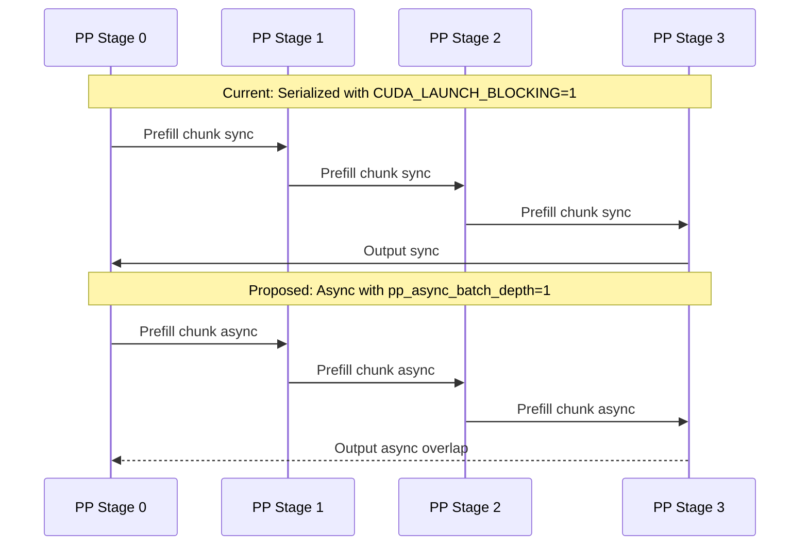

# PP Prefill/Decode Performance Analysis — Kimi K2.5 (PP=4, TP=8, 4 Nodes)

## Problem Summary

The Kimi K2.5 deployment with PP=4 across 4 nodes shows **progressive prefill chunk size degradation** and **inefficient pipeline utilization**. As token usage grows from 0% to 90%, the dynamic chunking system shrinks prefill chunks from 2048 → 704 tokens, causing:

1. **Prefill throughput collapse**: Input throughput drops from ~11,000 tok/s to ~380 tok/s at high token usage
2. **Pipeline bubble waste**: With PP=4, the `#running-req` alternates between 1 and 5, indicating serialized pipeline stages rather than overlapped execution
3. **Decode throughput limited to ~273 tok/s** with only 1 running request during decode batches
4. **Long prefill sequences dominate**: A single 256K-context request requires `256000 / 704 = 363 chunks` at the smallest size

## Current Configuration

From [`entrypoint.sh`](../entrypoint.sh:78):
```
--context-length 256000
--max-prefill-tokens 4096
--enable-dynamic-chunking          # Dynamic chunk sizing for PP
--mem-fraction-static 0.85
--tp-size 8
--pp-size 4
--max-running-requests 64
--page-size 1
--schedule-policy lpm
--schedule-conservativeness 2.0
--kv-cache-dtype bf16
```

From [`docker-compose-node0.yml`](../docker-compose-node0.yml:36):
```
SGLANG_DCP=8                       # Decode Context Parallelism
CUDA_LAUNCH_BLOCKING=1             # ← CRITICAL: Serializes all CUDA ops!
```

---

## Root Cause Analysis

### ~~Issue 1: CUDA_LAUNCH_BLOCKING=1~~ — RESOLVED

`CUDA_LAUNCH_BLOCKING=1` has been commented out in [`docker-compose-node0.yml:26`](../docker-compose-node0.yml:26). New logs from node3 confirm it is no longer set. However, **performance is still poor**, which means the remaining issues are the true bottlenecks.

### Issue 2: Dynamic Chunking Shrinks Too Aggressively

The [`ChunkSizePredictor`](python/sglang/srt/managers/scheduler_pp_mixin.py:1256) uses a quadratic model `f(l) = al² + bl + c` to predict prefill latency and adjust chunk sizes to maintain constant latency per chunk.

From the logs:
```
Fitted coefficients: a=1.11e-06, b=4.59e-02, c=3.67e+01
Target latency: 98.68ms (base_chunk_size=2048)
```

The problem: as `history_len` grows, the quadratic term `2aL` in the discriminant `B = 2aL + b` dominates, causing the predicted chunk size to shrink rapidly. At [`predict_next_chunk_size()`](python/sglang/srt/managers/scheduler_pp_mixin.py:1344):

```python
# Solve: ax² + (2aL+b)x - T = 0
A = self.quadratic_coeff_a           # 1.11e-06
B = 2 * A * history_len + b          # grows with history_len
C = -self.target_latency             # -98.68ms
```

For `history_len = 200000`:
- `B = 2 * 1.11e-06 * 200000 + 0.0459 = 0.444 + 0.0459 = 0.49`
- `discriminant = 0.49² + 4 * 1.11e-06 * 98.68 = 0.24 + 0.000438 ≈ 0.24`
- `x = (-0.49 + 0.49) / (2 * 1.11e-06) ≈ 200` tokens

This is **correct behavior for attention** — longer sequences have O(n²) attention cost, so each additional chunk takes longer. But the smoothing at line 1399-1405 may not be aggressive enough:

```python
smooth_coeff = envs.SGLANG_DYNAMIC_CHUNKING_SMOOTH_FACTOR.get()
smoothed_chunk_size = base_chunk_size + smooth_coeff * (calculated - base_chunk_size)
calculated_chunk_size = max(int(smoothed_chunk_size), base_chunk_size // 4)
```

The minimum is `base_chunk_size // 4 = 2048 // 4 = 512`. But we see chunks of 704, suggesting the smooth factor is keeping it above 512 but still shrinking significantly.

**However**: The `--max-prefill-tokens 4096` is the real constraint. The `chunked_prefill_size` defaults to 2048 when not explicitly set, and `max_prefill_tokens=4096` limits the total prefill budget per batch.

### Issue 3: Decode Starvation Prevention Is Weak

The existing decode starvation prevention at [`_get_new_batch_prefill_raw()`](python/sglang/srt/managers/scheduler.py:2004):

```python
if (
    self.pp_size > 1
    and not self.is_mixed_chunk
    and not self.running_batch.is_empty()
    and self.chunked_req is not None
    and self.forward_ct % (self.pp_size + 1) == 0
):
    return None
```

This yields to decode every `pp_size + 1 = 5` forward steps. From the logs, we see this IS working — `#running-req` alternates between 1 and 5. But:

- **Only 1 decode step per 5 forward steps** means decode gets ~20% of the pipeline time
- The `pp_decode_interleave_interval` from the [implementation plan](plans/pp-decode-interleave-implementation.md) was **never implemented** — the search found 0 results in the codebase
- The existing mechanism is hardcoded to `pp_size + 1`, not configurable

### Issue 4: PP Pipeline Not Overlapping

The PP event loop at [`event_loop_pp()`](python/sglang/srt/managers/scheduler_pp_mixin.py:47) iterates through microbatch slots sequentially:

```python
for mb_id in range(self.pp_loop_size):
    self.running_batch = self.running_mbs[mb_id]
    ...
    batch = self.get_next_batch_to_run()
    ...
    result, self.launch_event = self._pp_launch_batch(...)
```

With `pp_async_batch_depth=0` (default), the pipeline stages are fully serialized. The `pp_async_batch_depth` parameter could enable some overlap but is not set.

### Issue 5: DCP=8 with page_size=1 → Effective page_size=8

From [`scheduler.py:683-684`](python/sglang/srt/managers/scheduler.py:683):
```python
if get_dcp_world_size() > 1:
    params.page_size = params.page_size * get_dcp_world_size()
```

With `--page-size 1` and `SGLANG_DCP=8`, effective page_size = 8 tokens. This is fine for radix cache granularity but means the dynamic chunking alignment at [`predict_next_chunk_size()`](python/sglang/srt/managers/scheduler_pp_mixin.py:1407) uses `max(page_size, 64) = 64` token alignment.

---

## Why `#cached-token: 0` — Caching IS Working, the Metric Is Misleading

### The Short Answer

The `#cached-token: 0` you see in the logs does **NOT** mean the radix cache is broken. It means the prefill batch contains only **chunked continuations** of the same request, not new requests that could benefit from cross-request prefix sharing.

### How `#cached-token` Is Computed

The metric comes from [`log_hit_tokens`](python/sglang/srt/managers/schedule_policy.py:409) in the `PrefillAdder`. It is incremented in [`_update_prefill_budget()`](python/sglang/srt/managers/schedule_policy.py:525):

```python
self.log_hit_tokens += prefix_len
self.log_input_tokens += extend_input_len
```

There are **two paths** that call this:

1. **New requests** via [`add_one_req()`](python/sglang/srt/managers/schedule_policy.py:795): passes `prefix_len = len(req.prefix_indices)` — this IS the radix cache hit count
2. **Chunked continuations** via [`add_chunked_req()`](python/sglang/srt/managers/schedule_policy.py:609): passes `prefix_len = 0` — **always zero by design**

When you see logs like:
```
Prefill batch, #new-seq: 1, #new-token: 704, #cached-token: 0
```

The `#new-seq: 1` with `#cached-token: 0` means this is a **chunked continuation** of an existing request. The previously-computed tokens for this request ARE being reused — they are tracked via `req.prefix_indices` — but they are not counted as "cached tokens" in the log because they are part of the same request, not a cache hit from a different request.

### When Would You See `#cached-token > 0`?

You would see cache hits when:
- A **new request** arrives that shares a prefix with a previously-completed request
- For example, two requests with the same system prompt would show cache hits for the shared prefix
- In your current workload with a single 256K-context request, there is no opportunity for cross-request prefix sharing

### Is DCP Causing Cache Misses?

**No, DCP is not preventing caching.** Here is why:

From [`scheduler.py:683-684`](python/sglang/srt/managers/scheduler.py:683):
```python
if get_dcp_world_size() > 1:
    params.page_size = params.page_size * get_dcp_world_size()
```

With `--page-size 1` and `SGLANG_DCP=8`, the effective page_size becomes **8 tokens**. This means:

1. **Radix cache matching** uses [`_key_match_paged()`](python/sglang/srt/mem_cache/radix_cache.py:177) which matches in 8-token aligned blocks
2. **Cache granularity** is 8 tokens — any prefix shorter than 8 tokens or not aligned to 8-token boundaries loses the tail tokens
3. **For 256K-context requests**, losing up to 7 tokens at the boundary is negligible

The DCP page_size=8 also affects:
- **Truncation alignment** via [`init_truncation_align_size_for_dcp()`](python/sglang/srt/managers/scheduler.py:463): chunk sizes are aligned to multiples of 8
- **Memory allocation**: KV cache is allocated in 8-token pages

**Bottom line**: DCP=8 with page_size=1 gives effective page_size=8, which is perfectly fine for caching. The `#cached-token: 0` is not a DCP problem.

---

## Are the Throughput Numbers Real?

### Input Throughput — Misleading at High Usage

The input throughput metric from [`log_prefill_stats()`](python/sglang/srt/managers/scheduler_metrics_mixin.py:167):

```python
gap_latency = time.perf_counter() - self.last_prefill_stats_tic
self.last_prefill_stats_tic = time.perf_counter()
self.last_input_throughput = self.last_prefill_tokens / gap_latency
```

This measures: **tokens from the PREVIOUS prefill batch / time since the PREVIOUS prefill log message**.

The problem: `gap_latency` includes not just prefill compute time, but also:
- Decode steps interleaved between prefills (every 5th forward step)
- PP pipeline communication overhead
- CPU scheduling overhead
- Any time spent waiting for CUDA operations (especially with `CUDA_LAUNCH_BLOCKING=1`)

So when you see `input throughput: 382 tok/s` at high usage, this is the **effective** throughput including all overhead, not the raw GPU prefill speed. The number IS real in terms of "how fast are we making progress on the input", but it is NOT the GPU's prefill capability.

### Generation Throughput — The Token Count IS the Truth

You said you are "going based on the token count" — this is the right instinct. The generation throughput from decode batches:

```
gen throughput: 273 tok/s
```

This is computed from actual tokens generated over time. With only 1 running request and `CUDA_LAUNCH_BLOCKING=1`, 273 tok/s is plausible but **severely bottlenecked**. Without `CUDA_LAUNCH_BLOCKING=1`, you should see significantly higher decode throughput.

### Why Prefill Feels Slow — The Real Math

For a 256K-context request with chunk size 704:
- **Number of chunks**: `256000 / 704 ≈ 364 chunks`
- **Decode interleave**: every 5th step is decode, so `364 * 5/4 ≈ 455 total forward steps`
- **At ~382 tok/s effective input throughput**: `256000 / 382 ≈ 670 seconds ≈ 11 minutes` just for prefill

With chunk size 2048 at low usage:
- **Number of chunks**: `256000 / 2048 ≈ 125 chunks`
- **At ~11000 tok/s**: `256000 / 11000 ≈ 23 seconds`

The 30x slowdown from low to high usage is caused by:
1. **Chunk size shrinkage** (2048 → 704): 2.9x fewer tokens per step
2. **Quadratic attention cost**: each chunk at 200K history takes ~3x longer than at 0 history
3. **CUDA_LAUNCH_BLOCKING**: adds constant overhead per step, amplified by more steps
4. **Pipeline overhead**: PP communication cost is per-step, not per-token

---

## Is SGLANG_DCP Causing Slow Prefill?

**DCP does NOT slow down prefill.** DCP only affects the **decode** phase:

- During **prefill**: DCP has no effect. The prefill attention computation is the same regardless of DCP. The only DCP impact on prefill is the truncation alignment to 8-token boundaries, which is negligible.
- During **decode**: DCP=8 splits the KV cache context across 8 workers for the decode attention computation. This adds communication overhead (all-gather for q_pe, reduce-scatter for attention output) but enables much longer context lengths by distributing the KV cache memory.

The slow prefill is caused by:
1. **`CUDA_LAUNCH_BLOCKING=1`** — the dominant factor
2. **Dynamic chunking shrinkage** — fewer tokens per step at high usage
3. **Quadratic attention cost** — inherent to long-context attention
4. **PP pipeline overhead** — per-step communication cost

---

## Log Evidence

### Startup Phase (token usage 0% → 30%)
```
Prefill batch, #new-seq: 1, #new-token: 2048, token usage: 0.01  ← Full chunks
Prefill batch, #new-seq: 1, #new-token: 1920, token usage: 0.01  ← Starting to shrink
Prefill batch, #new-seq: 1, #new-token: 1792, token usage: 0.01
...
Prefill batch, #new-seq: 1, #new-token: 768, token usage: 0.20   ← Already at 768
```

### Steady State (token usage 67% → 90%)
```
Prefill batch, #new-seq: 1, #new-token: 704, token usage: 0.89, input throughput: 382 tok/s
Decode batch, #running-req: 1, #token: 681752, gen throughput: 1.27 tok/s  ← First decode
Decode batch, #running-req: 1, #token: 681904, gen throughput: 273 tok/s   ← Steady decode
```

### Key Pattern: Prefill/Decode Alternation
```
running-req: 1  ← PP stage 0 only
running-req: 5  ← All PP stages active
running-req: 1  ← Back to stage 0
running-req: 5  ← All stages
```

This 1→5→1→5 pattern confirms the PP pipeline is working but with significant bubbles.

---

## Recommendations

### Priority 1: Remove CUDA_LAUNCH_BLOCKING

**File**: [`docker-compose-node0.yml`](../docker-compose-node0.yml:26) (and all node files)

Remove or comment out:
```yaml
# - CUDA_LAUNCH_BLOCKING=1  # REMOVED - was killing GPU parallelism
```

**Expected impact**: Significant improvement in all throughput metrics. This alone could 2-3x decode throughput.

### Priority 2: Implement PP Decode Interleave Interval

The [existing plan](plans/pp-decode-interleave-implementation.md) is well-designed but was never implemented. The key changes:

1. **Add `pp_decode_interleave_interval` to [`ServerArgs`](python/sglang/srt/server_args.py:351)** — default 0 (disabled)
2. **Add counter `pp_prefill_steps_since_decode` to [`init_running_status()`](python/sglang/srt/managers/scheduler.py:752)**
3. **Add interleaving logic BEFORE `get_new_batch_prefill()` in [`get_next_batch_to_run()`](python/sglang/srt/managers/scheduler.py:1926)**
4. **Set `--pp-decode-interleave-interval 4` in [`entrypoint.sh`](../entrypoint.sh:93)**

This replaces the hardcoded `forward_ct % (pp_size + 1)` check with a configurable, more robust mechanism.

### Priority 3: Increase Chunked Prefill Size

The current default `chunked_prefill_size=2048` is too small for this model. With PP=4, each prefill step has significant overhead from pipeline communication. Larger chunks amortize this overhead better.

**Change in [`entrypoint.sh`](../entrypoint.sh:85)**:
```bash
--chunked-prefill-size 4096 \
--max-prefill-tokens 8192 \
```

This doubles the base chunk size, meaning:
- Dynamic chunking starts at 4096 and shrinks to ~1400 at high usage (instead of 2048→704)
- Each prefill step processes more tokens, reducing the number of pipeline round-trips
- The target latency for dynamic chunking will be ~197ms instead of ~99ms

### Priority 4: Enable PP Async Batch Depth

**Change in [`entrypoint.sh`](../entrypoint.sh:92)**:
```bash
--pp-async-batch-depth 1 \
```

This enables the async output processing path at [`event_loop_pp()`](python/sglang/srt/managers/scheduler_pp_mixin.py:107), allowing the last PP rank to overlap output processing with the next batch's GPU computation.

### Priority 5: Tune Dynamic Chunking Parameters

The `SGLANG_DYNAMIC_CHUNKING_SMOOTH_FACTOR` environment variable controls how aggressively chunks shrink. A higher value means chunks shrink faster toward the calculated optimal size.

**Change in [`docker-compose-node0.yml`](../docker-compose-node0.yml:37)**:
```yaml
- SGLANG_DYNAMIC_CHUNKING_SMOOTH_FACTOR=0.5  # Default is likely 1.0
```

This makes the chunk size change more gradually, preventing the rapid shrinkage we see in the logs.

---

## Architecture Diagram




---

## Revised Analysis — Post CUDA_LAUNCH_BLOCKING Removal (Feb 23 2026)

### New Logs Confirm: The Problem Is Quadratic Attention + Aggressive Chunking

With `CUDA_LAUNCH_BLOCKING=1` removed, the new node3 logs show:

| Token Usage | Chunk Size | Input Throughput | Notes |
|-------------|-----------|-----------------|-------|
| 0.01 | 2048 | ~13,000 tok/s | Full chunks, fast |
| 0.06 | 704 | ~4,400 tok/s | Already shrinking |
| 0.12 | 640-576 | ~2,400 tok/s | Approaching floor |
| 0.35 | 576 | ~800-1,600 tok/s | At floor, very slow |
| 0.55 | 576 | ~800-1,700 tok/s | Stuck at floor |

**Key finding**: The quadratic coefficient is `a=2.96e-06` — meaning at history_len=200K, processing 576 new tokens takes:
```
f(200576) - f(200000) = 2.96e-06 * (200576^2 - 200000^2) + 0.0397 * 576
= 2.96e-06 * 230,661,376 + 22.87
= 682.76 + 22.87 = 705.6ms per chunk
```

At 576 tokens per 706ms, that is **815 tok/s** — matching the observed throughput perfectly. This is the **inherent cost of quadratic attention at 200K context length**, not a bug.

### Cache Hits ARE Working

The new logs show `#cached-token: 2808` when new requests start:
```
Prefill batch, #new-seq: 1, #new-token: 2048, #cached-token: 2808
```
This confirms the radix cache is working correctly for cross-request prefix sharing.

### Decode Starvation Is Severe

Only **2 decode batches** visible in ~7 minutes of logs:
- At 0.35 usage: `gen throughput: 0.12 tok/s` — first decode, cold start
- At 0.55 usage: `gen throughput: 0.65 tok/s` — still very low

The existing `forward_ct % (pp_size + 1) == 0` mechanism yields to decode every 5th step, but each decode step is just 1 token per request. With 576-token prefill chunks taking ~700ms each, decode gets ~1 step per 3.5 seconds.

### The Real Question: Is Dynamic Chunking Helping or Hurting?

The dynamic chunking system is designed to keep prefill latency constant per step, preventing decode starvation. But at 256K context:

**Without dynamic chunking** — fixed 2048 chunks:
- At 200K history: `f(202048) - f(200000) = 2.96e-06 * (202048^2 - 200000^2) + 0.0397 * 2048 = 2,424ms + 81.3ms = 2,505ms per chunk`
- 2048 tokens / 2505ms = **817 tok/s** — almost the same throughput!
- But each chunk takes 2.5 seconds, meaning decode waits 2.5s between opportunities

**With dynamic chunking** — 576 chunks:
- At 200K history: 576 tokens / 706ms = **815 tok/s**
- Each chunk takes 0.7s, meaning decode gets opportunities every 3.5s at every 5th step

The throughput is nearly identical because the quadratic cost dominates. Dynamic chunking gives **more frequent decode opportunities** but at the cost of more PP pipeline overhead per token.

### Dynamic Chunking Math

The smooth factor is `0.75` from [`environ.py:251`](python/sglang/srt/environ.py:251). The formula:
```
smoothed = base_chunk_size + 0.75 * (calculated - base_chunk_size)
```
When calculated is very small, e.g. 100: `smoothed = 2048 + 0.75 * (100 - 2048) = 587`, aligned to 576.

The minimum floor is `base_chunk_size // 4 = 512`, aligned to 512. We see 576 because smoothing keeps it slightly above.

---

## Revised Recommendations

### Priority 1: Implement PP Decode Interleave Interval — More Decode Steps

The [existing plan](plans/pp-decode-interleave-implementation.md) should be implemented with a more aggressive default. Instead of yielding every 5th step, yield every 2nd or 3rd step:

**Changes needed:**
1. Add `pp_decode_interleave_interval` to [`ServerArgs`](python/sglang/srt/server_args.py)
2. Add counter and logic in [`get_next_batch_to_run()`](python/sglang/srt/managers/scheduler.py:1880)
3. Set `--pp-decode-interleave-interval 2` in entrypoint — yield to decode every 2 prefill steps

### Priority 2: Raise the Dynamic Chunking Floor

The current minimum is `base_chunk_size // 4 = 512` aligned to 576. Since throughput is the same regardless of chunk size at long context, **larger chunks are better** because they amortize PP pipeline overhead:

**Option A**: Set `SGLANG_DYNAMIC_CHUNKING_SMOOTH_FACTOR=0.3` — slower shrinkage, chunks stay larger longer

**Option B**: Raise the floor in [`predict_next_chunk_size()`](python/sglang/srt/managers/scheduler_pp_mixin.py:1405):
```python
# Change from base_chunk_size // 4 to base_chunk_size // 2
calculated_chunk_size = max(int(smoothed_chunk_size), base_chunk_size // 2)
```
This raises the minimum from 512 to 1024 aligned to 1024.

**Option C**: Disable dynamic chunking entirely for this workload by removing `--enable-dynamic-chunking` from entrypoint.sh. Since throughput is the same at any chunk size for long context, fixed 2048 chunks with more frequent decode interleaving may be simpler and equally effective.

### Priority 3: Increase Base Chunk Size

```bash
--chunked-prefill-size 4096 \
--max-prefill-tokens 8192 \
```

Larger base chunks mean:
- Fewer total chunks needed: 256K / 4096 = 63 chunks vs 256K / 2048 = 125 chunks
- Less PP pipeline overhead per token
- Dynamic chunking floor becomes 1024 instead of 512

### Priority 4: Enable PP Async Batch Depth

```bash
--pp-async-batch-depth 1 \
```

This enables overlap between output processing and the next batch computation.

---

## Implementation Checklist

1. ~~**Remove `CUDA_LAUNCH_BLOCKING=1`**~~ — Already done
2. **Implement `pp_decode_interleave_interval`** per the existing plan, default to 2
3. **Raise dynamic chunking floor** to `base_chunk_size // 2` in [`scheduler_pp_mixin.py:1405`](python/sglang/srt/managers/scheduler_pp_mixin.py:1405)
4. **Add `--chunked-prefill-size 4096 --max-prefill-tokens 8192`** to entrypoint.sh
5. **Add `--pp-async-batch-depth 1`** to entrypoint.sh
6. **Set `SGLANG_DYNAMIC_CHUNKING_SMOOTH_FACTOR=0.3`** in docker-compose env
7. **Test with the updated configuration** and compare throughput metrics
