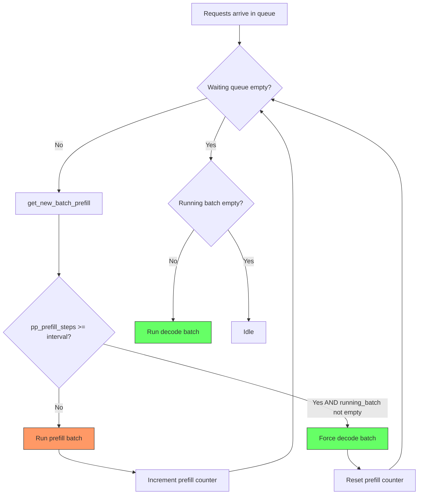
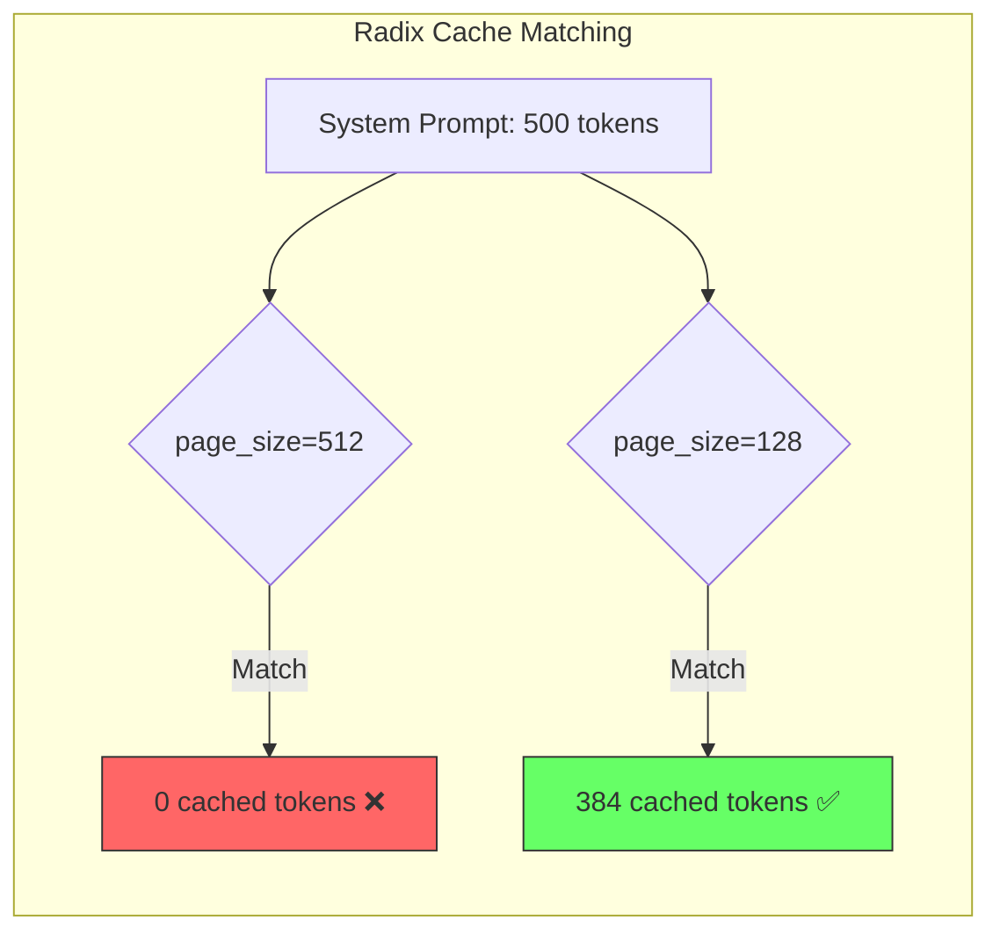

# Prefill Stall Analysis - Kimi K2.5 with PP=4, DCP=8

## Problem Summary

The server is experiencing **severe prefill starvation of decode batches**. The scheduler continuously runs prefill batches (one 2048-token chunk per batch) without ever yielding to decode, causing:

1. **Decode starvation**: Running requests get no decode steps for 30+ seconds at a time
2. **Throughput collapse**: Input throughput degrades from ~8400 tok/s down to ~3300 tok/s as KV cache fills up
3. **Token usage climbs to ~97%** before any decode batch runs, at which point requests finish/abort and the cycle restarts
4. **Absurd throughput spikes**: Values like `341,197 tok/s` and `184,863 tok/s` appear when the measurement window is near-zero

## Current Configuration

From [`entrypoint.sh`](../entrypoint.sh:78):
```bash
--context-length 256000
--max-prefill-tokens 8192
--chunked-prefill-size 8192
--mem-fraction-static 0.85
--tp-size 8
--pp-size 4
--max-running-requests 64
--page-size 64
--schedule-policy lpm              # ← Longest Prefix Match (good for radix cache)
--schedule-conservativeness 1.5
--kv-cache-dtype bf16
# --disable-radix-cache            # ← COMMENTED OUT (radix cache IS enabled)
# --enable-mixed-chunk             # ← COMMENTED OUT (disabled)
```

From [`docker-compose-node3.yml`](../docker-compose-node3.yml:36):
```
SGLANG_DCP=8                   # Decode Context Parallelism enabled
```

---

## Root Cause Analysis

### 1. The Core Problem: Prefill Always Wins Over Decode

In [`get_next_batch_to_run()`](python/sglang/srt/managers/scheduler.py:1942):

```python
if new_batch is not None:
    # Run prefill first if possible
    ret = new_batch
else:
    # Run decode
    ...
```

**Prefill always takes priority over decode.** Combined with:

- **`--context-length 256000`**: A single request could require `256000 / 2048 = 125 chunks`. During all chunks, no decode happens.
- **`--enable-mixed-chunk` is NOT set**: Prefill and decode batches are **mutually exclusive**. When a prefill batch runs, zero decode tokens are generated.
- **PP=4 with chunked prefill**: The PP loop in [`event_loop_pp()`](python/sglang/srt/managers/scheduler_pp_mixin.py:47) calls `get_next_batch_to_run()` for each microbatch slot. Since there are always waiting requests AND an active `chunked_req`, the scheduler always returns a prefill batch.

### 2. Why `#new-token: 2048` Per Batch

The `#new-token: 2048` is the **chunk size per prefill step**, not the total request length. With `chunked_prefill_size=8192` and `max_prefill_tokens=8192`, the effective chunk is reduced by the [`PrefillAdder`](python/sglang/srt/managers/schedule_policy.py:372) budget after accounting for `new_token_ratio` (schedule-conservativeness=1.5) and DCP truncation alignment. The budget calculation in [`add_chunked_req()`](python/sglang/srt/managers/schedule_policy.py:591) truncates to `truncation_align_size` boundaries (DCP=8).

### 3. Why Throughput Numbers Look Wrong

The throughput calculation in [`scheduler_metrics_mixin.py:169`](python/sglang/srt/managers/scheduler_metrics_mixin.py:169):
```python
self.last_input_throughput = self.last_prefill_tokens / gap_latency
```

When multiple prefill batches run back-to-back with near-zero gap, `gap_latency` approaches zero, producing absurd values like `341,197 tok/s`.

---

## Page Size Analysis — CRITICAL for Radix Cache

### Current: `--page-size 64` with DCP=8

The DCP multiplier at [`scheduler.py:683-684`](python/sglang/srt/managers/scheduler.py:683):
```python
if get_dcp_world_size() > 1:
    params.page_size = params.page_size * get_dcp_world_size()
```

**Effective internal page_size = 64 × 8 = 512 tokens**

### Impact on Radix Cache Matching

The radix cache prefix matching in [`_key_match_paged()`](python/sglang/srt/mem_cache/radix_cache.py:177) operates in **page_size-aligned blocks**:

```python
def _key_match_paged(key0, key1, page_size):
    i = 0
    while i < min_len:
        if key0.token_ids[i : i + page_size] != key1.token_ids[i : i + page_size]:
            break
        i += page_size
    return i
```

With effective page_size=512:
- **Prefix matching happens in 512-token blocks**
- If two requests share a 500-token system prompt → **0 cached tokens** (not enough to fill one page)
- If two requests share a 1000-token system prompt → **512 cached tokens** (only 1 full page matches)
- If two requests share a 2000-token system prompt → **1536 cached tokens** (3 full pages)

### Recommendation: Reduce page_size for Agentic Workloads

For agentic turn-based systems with shared system prompts, the 512-token matching granularity is **far too coarse**. Options:

| `--page-size` | Effective with DCP=8 | Cache Granularity | Trade-off |
|---------------|---------------------|-------------------|-----------|
| 64 (current) | 512 tokens | Very coarse | Best memory efficiency, worst cache hits |
| 16 | 128 tokens | Good | Good balance for most system prompts |
| 8 | 64 tokens | Fine | Better cache hits, slightly more overhead |
| 1 (default) | 8 tokens | Very fine | Best cache hits, most memory management overhead |

**Recommended: `--page-size 16`** → effective 128 tokens with DCP=8. This ensures:
- System prompts ≥128 tokens get meaningful cache hits
- `chunked_prefill_size % page_size == 0`: `8192 % 16 == 0` ✓
- Reasonable memory management overhead for 256K context

If system prompts are very short (<128 tokens), consider `--page-size 8` (effective 64 tokens).

---

## Radix Cache Analysis

### Current State: Radix Cache IS Enabled ✅

The [`entrypoint.sh`](../entrypoint.sh:114) has `--disable-radix-cache` commented out, so radix cache is active. The cache type selection at [`scheduler.py:685-733`](python/sglang/srt/managers/scheduler.py:685):

```python
if chunked_prefill_size is not None and disable_radix_cache:
    self.tree_cache = ChunkCache(params)      # No prefix caching
else:
    self.tree_cache = RadixCache(params)       # ← Currently used
```

### Schedule Policy: LPM ✅

The [`--schedule-policy lpm`](../entrypoint.sh:102) (Longest Prefix Match) is the optimal choice for maximizing radix cache hits. It sorts the waiting queue by longest prefix match at [`calc_priority()`](python/sglang/srt/managers/schedule_policy.py:132):

```python
if policy == CacheAwarePolicy.LPM:
    SchedulePolicy._sort_by_longest_prefix(waiting_queue, ...)
```

Note: LPM falls back to FCFS when queue > 128 requests ([`schedule_policy.py:159`](python/sglang/srt/managers/schedule_policy.py:159)). With 8-11 queued requests, this is not an issue.

### DCP + Radix Cache Compatibility ✅

Fully supported in the codebase:
- **DCP doc section 3.2.4**: RadixCache with DCP — cache stores KV for all DCP shards
- **DCP doc section 3.2.5**: ChunkedPrefill + RadixCache Hit with DCP
- [`common.py:361`](python/sglang/srt/mem_cache/common.py:361): *"Since tree_cache.page_size is (page_size * get_dcp_world_size), for dcp, always use alloc_paged_token_slots_extend"*

### Eviction Policy

Default is `lru` (Least Recently Used) at [`server_args.py:339`](python/sglang/srt/server_args.py:339). For agentic workloads where the same system prompts are reused frequently, LRU is the correct choice — frequently-used prefixes stay cached.

---

## PP + Mixed Chunk Incompatibility

### The Assertion

[`server_args.py:5107-5112`](python/sglang/srt/server_args.py:5107):
```python
if self.pp_size > 1:
    assert (
        self.disable_overlap_schedule
        and self.speculative_algorithm is None
        and not self.enable_mixed_chunk
    ), "Pipeline parallelism is not compatible with overlap schedule, speculative decoding, mixed chunked prefill."
```

### Why Mixed Chunk Cannot Work with PP

The PP event loop maintains **separate state per microbatch slot** at [`init_pp_loop_state()`](python/sglang/srt/managers/scheduler_pp_mixin.py:534):

```python
self.running_mbs = [ScheduleBatch(...) for _ in range(pp_loop_size)]
```

Each iteration swaps state:
```python
for mb_id in range(self.pp_loop_size):
    self.running_batch = self.running_mbs[mb_id]     # Restore
    ...
    self.running_mbs[mb_id] = self.running_batch     # Save back
```

Mixed chunk at [`_get_new_batch_prefill_raw():2196-2210`](python/sglang/srt/managers/scheduler.py:2196) absorbs decode requests into the prefill batch and empties `running_batch`:
```python
new_batch.mix_with_running(self.running_batch)       # Absorb decode reqs
self.running_batch = ScheduleBatch(reqs=[], ...)     # Empty!
```

This creates an irreconcilable state management problem: decode requests from `running_mbs[0]` get embedded in a MIXED batch, but PP's microbatch interleaving means the next iteration processes `running_mbs[1]`. Re-extracting and routing decode requests back to the correct microbatch slot is architecturally infeasible without a major PP redesign.

---

## Solution: Decode Interleaving for PP Mode

Since mixed chunk cannot work with PP, we implement **decode interleaving** — a mechanism that forces the scheduler to periodically yield to decode batches even when prefill work is available.

### Design

Add a counter `pp_prefill_steps_since_decode` that tracks consecutive prefill batches. After `pp_decode_interleave_interval` consecutive prefills, force a decode batch by temporarily suppressing prefill.

**Location**: [`get_next_batch_to_run()`](python/sglang/srt/managers/scheduler.py:1880)

```python
def get_next_batch_to_run(self) -> Optional[ScheduleBatch]:
    ...
    new_batch = self.get_new_batch_prefill()

    # PP decode interleaving: force decode after N consecutive prefills
    if (
        self.pp_size > 1
        and new_batch is not None
        and not self.running_batch.is_empty()
        and self.pp_prefill_steps_since_decode >= self.pp_decode_interleave_interval
    ):
        # Stash the chunked request if we are interrupting a multi-chunk prefill
        if self.chunked_req is not None:
            self.stash_chunked_request(self.chunked_req)
        new_batch = None  # Force decode this step
        self.pp_prefill_steps_since_decode = 0

    if new_batch is not None:
        self.pp_prefill_steps_since_decode += 1
        ret = new_batch
    else:
        self.pp_prefill_steps_since_decode = 0
        # Run decode
        ...
```

### Why This Is Safe

1. **Chunked request stash/restore already exists**: The scheduler already handles interrupting chunked prefill via [`stash_chunked_request()`](python/sglang/srt/managers/scheduler.py:1877) and restoring it next iteration
2. **No state corruption**: We simply skip the prefill batch and run decode instead. The chunked request resumes on the next scheduling cycle.
3. **Configurable**: The interval can be tuned via a new `--pp-decode-interleave-interval` argument (default: 4)

### Configuration Parameter

Add to [`ServerArgs`](python/sglang/srt/server_args.py:272):
```python
pp_decode_interleave_interval: int = 4  # Force decode every N prefill steps in PP mode
```

---

## Implementation Plan

### Files to Modify

| File | Change |
|------|--------|
| [`python/sglang/srt/server_args.py`](python/sglang/srt/server_args.py) | Add `pp_decode_interleave_interval` argument with default=4 |
| [`python/sglang/srt/managers/scheduler.py`](python/sglang/srt/managers/scheduler.py) | Add decode interleaving logic in `get_next_batch_to_run()` and init counter in `init_running_status()` |

### Step-by-Step

1. **Add `pp_decode_interleave_interval` to `ServerArgs`** — new dataclass field + CLI argument
2. **Initialize counter in `init_running_status()`** — `self.pp_prefill_steps_since_decode = 0`
3. **Add interleaving logic in `get_next_batch_to_run()`** — after `get_new_batch_prefill()`, check counter and force decode when threshold reached
4. **Update entrypoint** — add `--pp-decode-interleave-interval 4` and reduce `--page-size` to 16

---

## Entrypoint Recommendations

| Setting | Current | Recommendation | Reason |
|---------|---------|----------------|--------|
| `--disable-radix-cache` | Commented out ✅ | Keep enabled | DCP supports radix cache; critical for agentic workloads |
| `--schedule-policy` | `lpm` ✅ | Keep LPM | Maximizes prefix cache hits for shared system prompts |
| `--page-size` | 64 | **Change to 16** | Effective 512→128 with DCP=8; 512 is too coarse for prefix matching |
| `--enable-mixed-chunk` | Commented out | ❌ Cannot enable | Hard assertion prevents use with PP=4 |
| `--chunked-prefill-size` | 8192 ✅ | Keep as-is | Good chunk size; 8192 % 16 == 0 |
| `--schedule-conservativeness` | 1.5 ✅ | Keep as-is | Reserves space for decode tokens |
| `--pp-decode-interleave-interval` | Not set | **Add with value 4** | New parameter from our fix |

### Recommended Entrypoint Changes

```bash
python3 -m sglang.launch_server \
    --host 0.0.0.0 \
    --model "${MODEL_DIR}" \
    --tokenizer-path "${MODEL_DIR}" \
    --sampling-defaults model \
    --api-key danucore \
    --context-length 256000 \
    --max-prefill-tokens 8192 \
    --chunked-prefill-size 8192 \
    --mem-fraction-static 0.85 \
    --enable-metrics \
    --tp-size 8 \
    --ep-size 1 \
    --dp-size 1 \
    --pp-size 4 \
    --max-running-requests 64 \
    --enable-cache-report \
    --cpu-offload-gb 0 \
    --served-model-name "${MODEL_PATH}" \
    --trust-remote-code \
    --disable-shared-experts-fusion \
    --attention-backend flashinfer \
    --moe-runner-backend triton \
    --fp8-gemm-backend cutlass \
    --schedule-policy lpm \
    --schedule-conservativeness 1.5 \
    --kv-cache-dtype bf16 \
    --page-size 16 \
    --pp-decode-interleave-interval 4 \
    --tool-call-parser kimi_k2 \
    --reasoning-parser kimi_k2 \
    --chat-template "${MODEL_DIR}/chat_template.jinja" \
    --port "${HOST_PORT}" \
    --dist-init-addr "${DIST_INIT_ADDR}" \
    --nnodes "${NNODES}" \
    --node-rank "${NODE_RANK}" &
```

**Key changes:**
1. **`--page-size 16`** (was 64) — effective 128 tokens with DCP=8 instead of 512; dramatically improves radix cache hit rate for shared system prompts
2. **`--pp-decode-interleave-interval 4`** — new parameter; forces decode batch every 4 prefill steps, eliminating decode starvation

---

## Expected Impact

### Decode Interleaving

**Before:**
```
Prefill → Prefill → Prefill → ... → Prefill (70+ consecutive) → Decode (1.75 tok/s)
```

**After:**
```
Prefill → Prefill → Prefill → Prefill → Decode → Prefill → Prefill → Prefill → Prefill → Decode → ...
```

- Decode batches run every ~4 prefill steps instead of every ~70+
- Generation throughput should increase dramatically (from 1.75 tok/s to 50-100+ tok/s)
- Token usage will stabilize at a lower level since decode tokens are being generated and freed

### Page Size Reduction

**Before (page_size=64, effective 512):**
- 500-token system prompt → 0 cached tokens
- 1000-token system prompt → 512 cached tokens

**After (page_size=16, effective 128):**
- 500-token system prompt → 384 cached tokens (3 full pages)
- 1000-token system prompt → 896 cached tokens (7 full pages)

For agentic workloads with repeated system prompts, this means:
- **Massive reduction in prefill work** — cached tokens skip prefill entirely
- **Fewer prefill steps per request** — less time before decode can run
- **Compounds with decode interleaving** — less prefill work + more frequent decode = much better throughput

---

## Architecture Diagram




